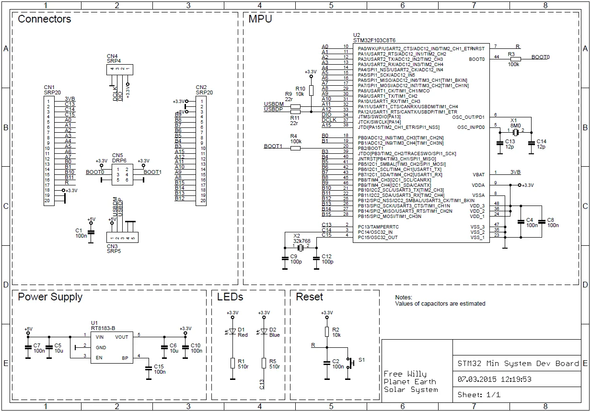
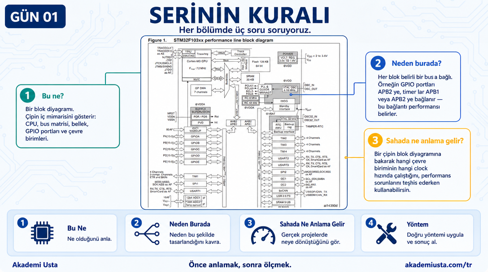
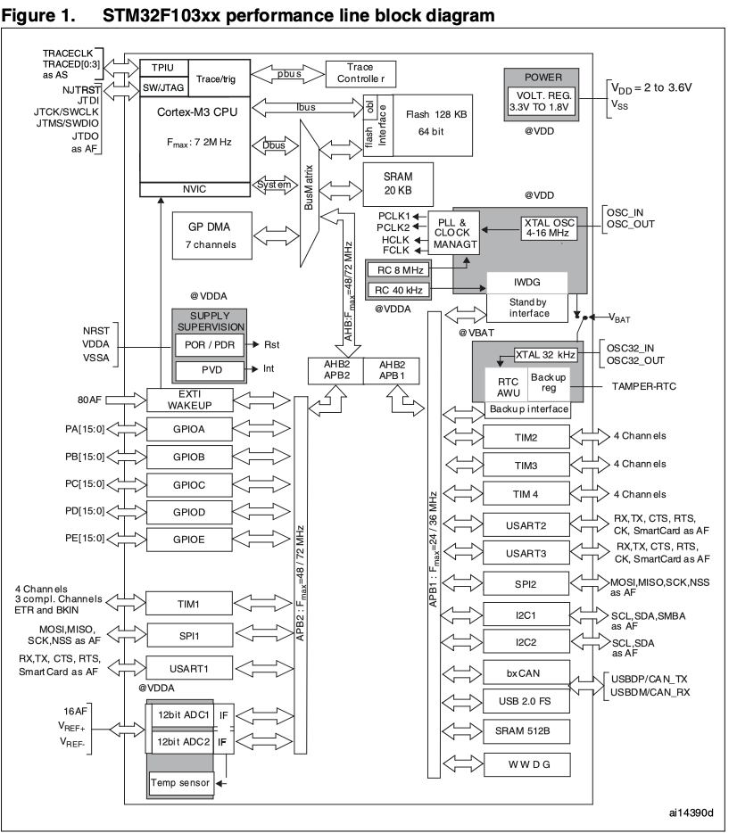

# Bölüm 01 — Neden Bu Kart?

> *Önce anlamak, sonra ölçmek.*


---

## Bu seri ne öğretiyor?

STM32 öğretmiyor.

**Düşünme biçimini öğretiyor.**

Seriyi bitirdiğinde elimde bir devre kartı olduğunda şu soruları sorabileceksin:

- Bu kart nasıl besleniyor?
- Clock nereden geliyor?
- İşlemci açılınca ne yapıyor?
- Bu pin neden burada?

Ve bu soruları sadece STM32 için değil — Apple, Qualcomm, Intel, ESP32 için de sorabileceksin.

---

## Neden STM32?


### Apple değil çünkü:
- Apple'ın datasheet'i kamuya açık değil
- Şeması açık kaynak değil
- Başlangıç için fazla karmaşık

### Qualcomm değil çünkü:
- Aynı sebep — kapalı ekosistem

### STM32 çünkü:
- **Datasheet tamamen açık** — ST Microelectronics resmi sitesinde
- **Şema açık kaynak** — Blue Pill şeması herkese açık
- **Ucuz ve yaygın** — 2-3 dolara alınabilen bir kart
- **Endüstride gerçek** — fabrika otomasyonundan medikal cihazlara kadar kullanılıyor

---

## Neden Blue Pill?


Blue Pill, STM32F103C8T6 işlemcisi üzerine kurulu minimal bir geliştirme kartıdır.

```
STM32F103C8T6
│
├── ARM Cortex-M3 CPU — 72 MHz
├── 64 KB Flash
├── 20 KB SRAM
├── USB, CAN, SPI, I2C, USART
└── 48 pin LQFP paket
```

Bu kart neden ideal?

- Şeması tek sayfa — karmaşık değil ama gerçek
- Her blok okunabilir: Power, Clock, Reset, MPU, LED, Connector
- Aynı mimari daha büyük STM32 kartlarında da var

---

## Şema açık kaynak mu?


Gerçek şema — okunaklı, tam boyutlu hâli (kaynak: [`assets/source/blue-pill-schematic-source.webp`](../assets/source/blue-pill-schematic-source.webp)):



Evet.

Bu repoda kullandığımız şema "STM32 Min System Dev Board" adıyla açık kaynak olarak yayınlanmış.

Tasarımcı notu şemada şöyle yazıyor:
```
Free Willy
Planet Earth
Solar System
```

Tüm datasheet ve şema kaynakları README'de listelenmiştir.

---

## Serinin kuralı



Gerçek datasheet sayfası — okunaklı, tam boyutlu hâli (kaynak: [`assets/source/stm32-block-diagram-source.png`](../assets/source/stm32-block-diagram-source.png)):



Her bölümde şu üç soruyu cevaplıyoruz:

1. **Bu ne?** — Bir blok diyagramı. Çipin iç mimarisini gösterir: CPU, bus matrisi, bellek, GPIO portları ve çevre birimleri.
2. **Neden burada?** — Her blok belirli bir bus'a bağlı. Örneğin GPIO portları APB2'ye, timer'lar APB1 veya APB2'ye bağlanır — bu bağlantı performansı belirler.
3. **Sahada ne anlama gelir?** — Bir çipin blok diyagramına bakarak hangi çevre biriminin hangi clock hızında çalıştığını, performans sorunlarını teşhis ederken kullanabilirsin.

---

## Sonraki bölüm

**[02 — Datasheet Nasıl Okunur?](../02-datasheet-nasil-okunur/README.md)**
