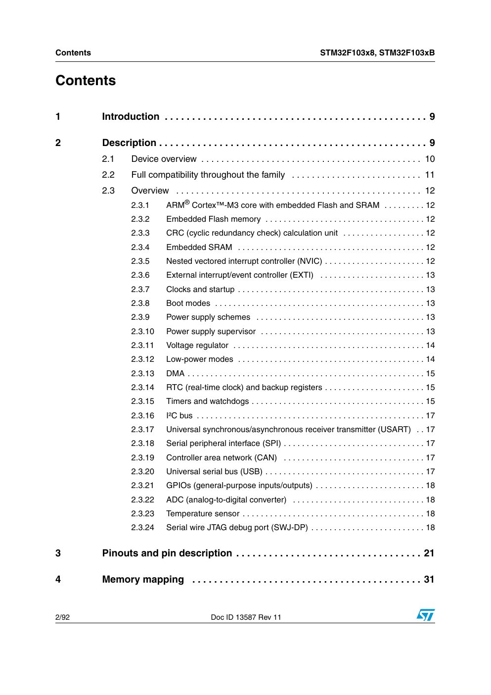

# Bölüm 02 — Datasheet Nasıl Okunur?

> *Datasheet bir roman değil. Bir sözlük.*

---

## Datasheet nedir?

Üretici firmanın yazdığı resmi teknik belgedir.

İçinde şunlar var:

- İşlemcinin tüm özellikleri
- Her pinin ne iş yaptığı
- Elektriksel limitler
- Zamanlama diyagramları
- Uygulama devreleri

STM32F103 için iki ayrı belge var. Bu fark önemli.

---

## Datasheet mi, Reference Manual mı?

Bu iki belgeyi karıştırmak çok yaygın bir hata.

| Belge | Ne içeriyor | Ne zaman açarsın |
|---|---|---|
| **Datasheet** | Özet özellikler, pin listesi, elektriksel limitler | "Bu işlemci ne yapabilir?" sorusunda |
| **Reference Manual (RM0008)** | Her peripheral'ın tam açıklaması, register detayları | "Clock nasıl ayarlanır?" sorusunda |

**Kural:** Genel bilgi → Datasheet. Detay → Reference Manual.

Bu seride ikisini de kullanacağız. Hangi soruyu hangi belgeden cevapladığımızı her bölümde belirteceğiz.

---

## Datasheet'i baştan sona okuma

Okuma. Gerçekten.

1000 sayfalık bir belgeyi baştan sona okumak ne işe yarar?

Mühendis şöyle okur:

```
Soru oluşur
    ↓
İçindekiler açılır
    ↓
İlgili bölüm bulunur
    ↓
O bölüm okunur
    ↓
Soru cevap bulur
```

---

## STM32F103 Datasheet — İçindekiler Haritası

Bu serinin kullandığı bölümler:

```
Datasheet (DS5319)
│
├── Features (Sayfa 1-3)
│   └── İşlemcinin özeti — BİZ BURADAN BAŞLIYORUZ
│
├── Ordering Information
│   └── Part number tablosu — STM32F103C8T6 kodu
│
├── Pinouts
│   └── 48-pin LQFP pinout — her pinin adı
│
├── Electrical Characteristics
│   └── Voltaj limitleri, akım değerleri
│
└── Package Information
    └── Fiziksel boyutlar
```

```
Reference Manual (RM0008)
│
├── Memory Map
├── RCC — Clock Control (Bölüm 7)
├── GPIO (Bölüm 9)
├── DMA (Bölüm 13)
├── ADC (Bölüm 11)
├── TIM — Timers (Bölüm 15-18)
├── USART (Bölüm 27)
├── SPI (Bölüm 25)
├── I2C (Bölüm 26)
└── USB (Bölüm 23)
```

---

## Datasheet'in ilk sayfası



Bu sayfa işlemcinin CV'si.

2 dakikada şunları öğreniyorsun:
- Kaç MHz çalışıyor
- Ne kadar Flash ve SRAM var
- Hangi iletişim protokolleri destekleniyor
- Hangi paket seçenekleri var

---

## Nerede bulunur?

- **STM32F103x8 Datasheet:** [st.com](https://www.st.com/en/microcontrollers-microprocessors/stm32f103c8.html) → Resources → Datasheet
- **RM0008 Reference Manual:** Aynı sayfada → Resources → Reference manual
- Her ikisi de ücretsiz, kayıt gerektirmez.

---

## Sonraki bölüm

**[03 — İlk Sayfa ve Part Number](../03-ilk-sayfa-ve-part-number/README.md)**
