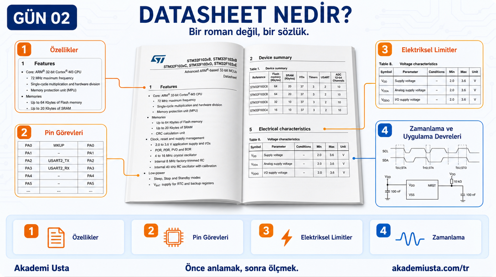
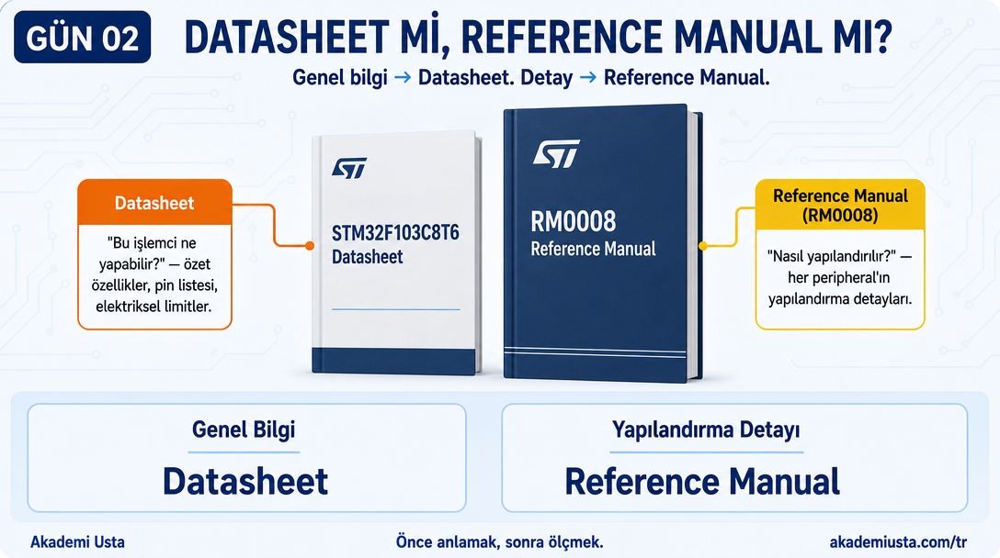
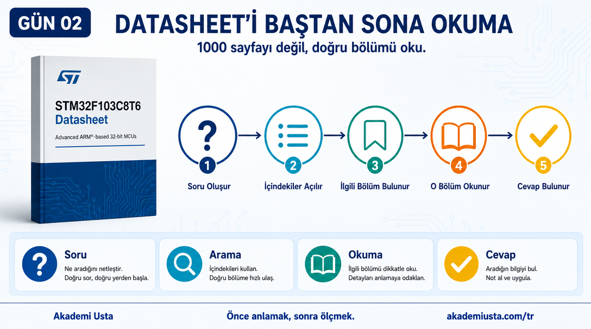
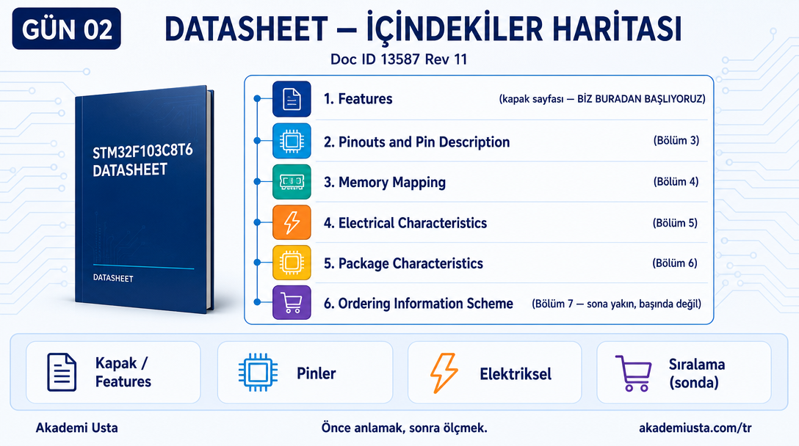
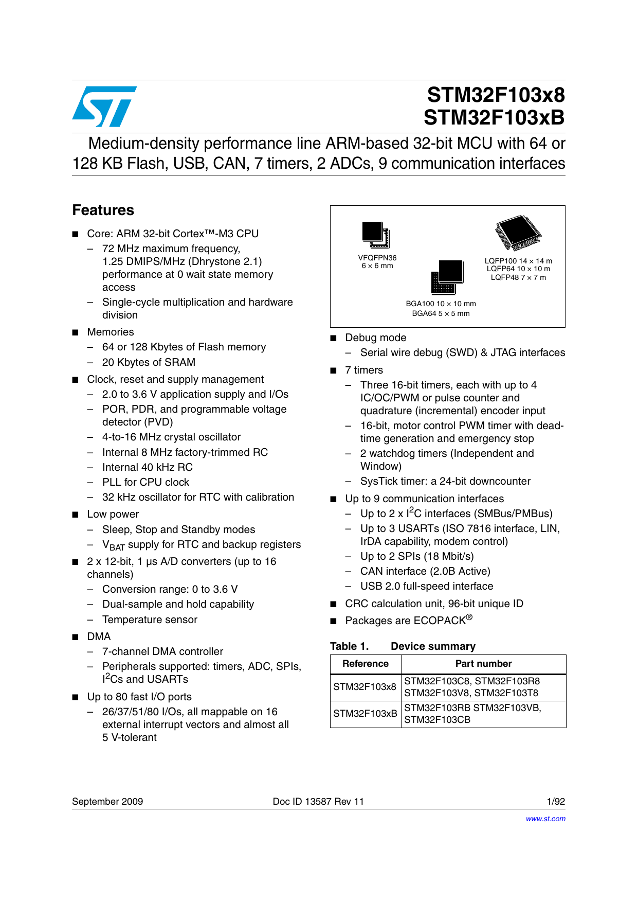
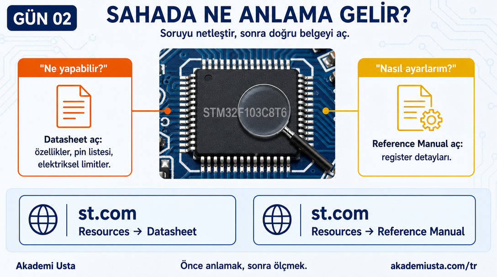

# Bölüm 02 — Datasheet Nasıl Okunur?

> *Datasheet bir roman değil. Bir sözlük.*



---

## Datasheet nedir?

Üretici firmanın yazdığı resmi teknik belgedir.

İçinde şunlar var:

- İşlemcinin tüm özellikleri
- Her pinin ne iş yaptığı
- Elektriksel limitler
- Zamanlama diyagramları
- Uygulama devreleri

STM32F103 için iki ayrı belge var. Bu fark önemli.

---

## Datasheet mi, Reference Manual mı?



Bu iki belgeyi karıştırmak çok yaygın bir hata.

| Belge | Ne içeriyor | Ne zaman açarsın |
|---|---|---|
| **Datasheet** | Özet özellikler, pin listesi, elektriksel limitler | "Bu işlemci ne yapabilir?" sorusunda |
| **Reference Manual (RM0008)** | Her peripheral'ın tam açıklaması, register detayları | "Clock nasıl ayarlanır?" sorusunda |

**Kural:** Genel bilgi → Datasheet. Detay → Reference Manual.

Bu seride ikisini de kullanacağız. Hangi soruyu hangi belgeden cevapladığımızı her bölümde belirteceğiz.

---

## Datasheet'i baştan sona okuma



Okuma. Gerçekten.

92 sayfalık bir belgeyi bile baştan sona okumak ne işe yarar?

Mühendis şöyle okur:

```
Soru oluşur
    ↓
İçindekiler açılır
    ↓
İlgili bölüm bulunur
    ↓
O bölüm okunur
    ↓
Soru cevap bulur
```

---

## Datasheet İçindekiler Haritası



Bu serinin kullandığı bölümler:

```
Datasheet (Doc ID 13587)
│
├── Features (kapak sayfası, 1-3)
│   └── İşlemcinin özeti — BİZ BURADAN BAŞLIYORUZ
│
├── Pinouts and Pin Description (Bölüm 3)
│   └── 48-pin LQFP pinout — her pinin adı
│
├── Memory Mapping (Bölüm 4)
│   └── Bellek adres haritası
│
├── Electrical Characteristics (Bölüm 5)
│   └── Voltaj limitleri, akım değerleri
│
├── Package Characteristics (Bölüm 6)
│   └── Fiziksel boyutlar
│
└── Ordering Information Scheme (Bölüm 7 — son bölümlerden biri, başında değil; hemen ardından sadece Revision History gelir)
    └── Part number tablosu — STM32F103C8T6 kodu
```

---

## Datasheet'in ilk sayfası



Bu sayfa işlemcinin CV'si.

2 dakikada şunları öğreniyorsun:
- Kaç MHz çalışıyor
- Ne kadar Flash ve SRAM var
- Hangi iletişim protokolleri destekleniyor
- Hangi paket seçenekleri var

**Şimdi sen dene:** Yukarıdaki gerçek sayfaya bak (veya `assets/source/STM32F103X8-datasheet.pdf`'i aç) ve şunları kendin bul:
1. Flash miktarı kaç KB?
2. Çalışma gerilimi aralığı ne (Volt cinsinden)?
3. LQFP48 paketi kaç pinli ve hangi tabloda geçiyor?

Cevapları ezberlemiyorsun — sayfada nereye bakacağını öğreniyorsun. Bu, bir sonraki bölümde tekrar kullanacağın bir beceri.

---

## Nerede bulunur?

- **STM32F103x8 Datasheet:** [st.com](https://www.st.com/en/microcontrollers-microprocessors/stm32f103c8.html) → Resources → Datasheet
- **RM0008 Reference Manual:** Aynı sayfada → Resources → Reference manual
- Her ikisi de ücretsiz, kayıt gerektirmez.

---

## Sahada Ne Anlama Gelir?



Elinde tanımadığın bir kart var. Üzerinde sadece işlemcinin part number'ı yazıyor, başka hiçbir şey bilmiyorsun.

```
Soru: "Bu işlemci ne yapabilir?" mi soruyorsun,
      "Bu peripheral'ı nasıl ayarlarım?" mı soruyorsun?

"Ne yapabilir?" → Datasheet aç (özellikler, pin listesi, limitler)
"Nasıl ayarlarım?" → Reference Manual aç (register detayları)
```

Yanlış belgede aramak zaman kaybettirir — 1134 sayfalık Reference Manual'da "kaç KB Flash var" aramak, ya da 92 sayfalık Datasheet'te "RCC register'ı nasıl set edilir" aramak gibi. Önce hangi soruyu sorduğunu netleştir, sonra doğru belgeyi aç.

---

*Bu bölümün tüm slaytları (hero + 4 sahne) Bölüm 01'de kurulan görsel standarda göre üretildi ve onaylandı (2026-07-14); video henüz render edilmedi — bkz. [`PRODUCTION.md`](../PRODUCTION.md).*

---

## Sonraki bölüm

**[03 — İlk Sayfa ve Part Number](../03-ilk-sayfa-ve-part-number/README.md)**
