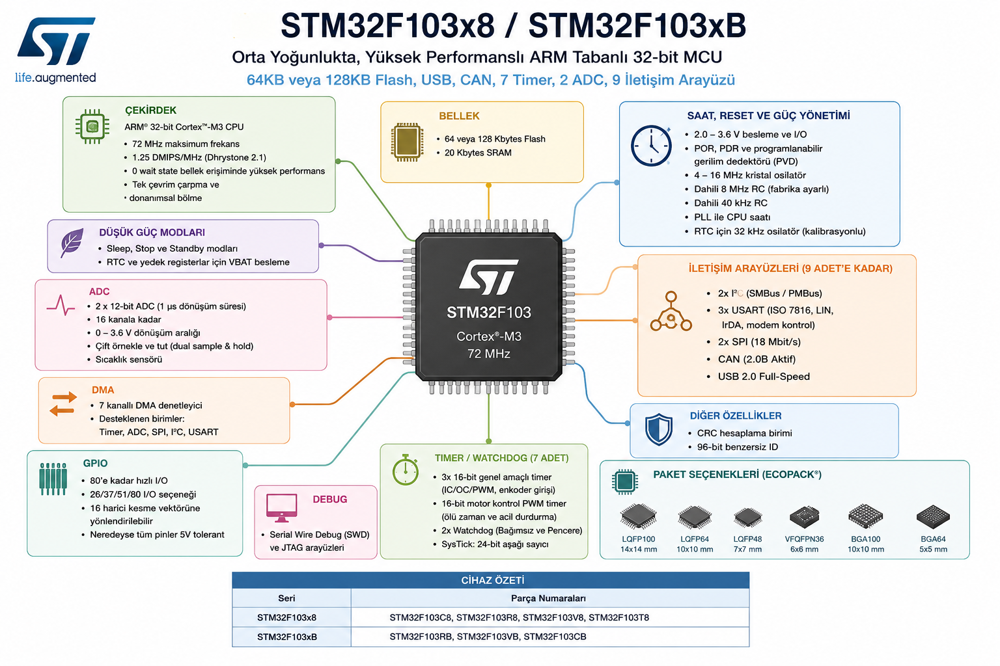

# Bölüm 03 — İlk Sayfa ve Part Number

> *Part number bir kılavuz. Her harf sana bir şey söylüyor.*

---

## İlk Sayfayı Okumak



Datasheet'in ilk sayfası işlemcinin CV'si.

Buradan 2 dakikada şunları anlıyoruz:

---

### Çekirdek
```
ARM 32-bit Cortex-M3 CPU
Maksimum 72 MHz
```

Bu işlemci 32-bit. Yani her saat darbesiyle 32 bit veri işleyebiliyor. Arduino Uno'daki ATmega328 8-bit. Fark: 4 kat geniş veri yolu.

---

### Bellek
```
64 KB veya 128 KB Flash
20 KB SRAM
```

Flash → program burada saklanır. Güç kesilince silinmez.
SRAM → çalışırken geçici veriler burada. Güç kesilince silinir.

Blue Pill'de 64 KB Flash var (C**8** — bunu part number'dan okuyoruz).

---

### İletişim
```
3x USART
2x SPI  
2x I2C
1x CAN
1x USB Full Speed
```

9 iletişim arayüzü. Bunların hepsi aynı anda kullanılabilir çünkü her biri ayrı donanım birimi.

---

### Diğerleri
```
2x 12-bit ADC (16 kanal)
7x Timer
7 kanallı DMA
80 GPIO pini
```

---

## Part Number Nasıl Okunur?

```
STM32F103C8T6
│││││││││││└─ 6: Sıcaklık aralığı (-40°C / +85°C)
││││││││││└── T: Paket tipi (LQFP)
│││││││││└─── 8: Flash boyutu (64 KB)
││││││││└──── C: Pin sayısı (48 pin)
│││││││└───── 103: Ürün serisi
││││││└────── F: Ürün ailesi (Foundation — genel amaçlı)
│││││└─────── 32: 32-bit mimari
││││└──────── M: Mikrodenetleyici
│││└───────── T: Mikrodenetleyici (devam)
││└────────── S: Üretici kodu
│└─────────── T: Üretici kodu
└──────────── S: ST Microelectronics
```

Daha sade haliyle:

| Parça | Değer | Anlamı |
|---|---|---|
| STM32 | — | ST, 32-bit |
| F | Foundation | Genel amaçlı seri |
| 103 | — | Ürün serisi |
| C | 48 | Pin sayısı |
| 8 | 64 KB | Flash boyutu |
| T | LQFP | Paket tipi |
| 6 | -40/+85°C | Sıcaklık sınıfı |

---

## Paket Seçenekleri

Aynı işlemci farklı paketlerde geliyor:

| Paket | Pin | Boyut | Tamirde ölçüm |
|---|---|---|---|
| LQFP48 | 48 | 7x7 mm | Kolay — bacaklar görünür |
| LQFP64 | 64 | 10x10 mm | Kolay |
| LQFP100 | 100 | 14x14 mm | Kolay |
| VFQFPN36 | 36 | 6x6 mm | Zor — bacaklar altında |
| BGA64/100 | 64/100 | 5x5 / 10x10 mm | Çok zor — toplar altında |

Blue Pill → **LQFP48** (7x7 mm, 48 bacaklı, ölçümü en kolay olanı).

---

## Sahada Ne Anlama Gelir?

Elinde tanımadığın bir kart var. İşlemcinin üzerinde şunu görüyorsun:

```
STM32F103RBT6
```

Part number'ı okuyorsun:
- R → 64 pin
- B → 128 KB Flash (C8'den iki kat büyük)
- T → LQFP paket
- 6 → standart sıcaklık

Artık o kartın bellek kapasitesini, pin sayısını ve paket tipini biliyorsun — hiçbir şey bağlamadan.

---

## Sonraki bölüm

**[04 — Şema Genel Bakış](../04-sema-genel-bakis/README.md)**
