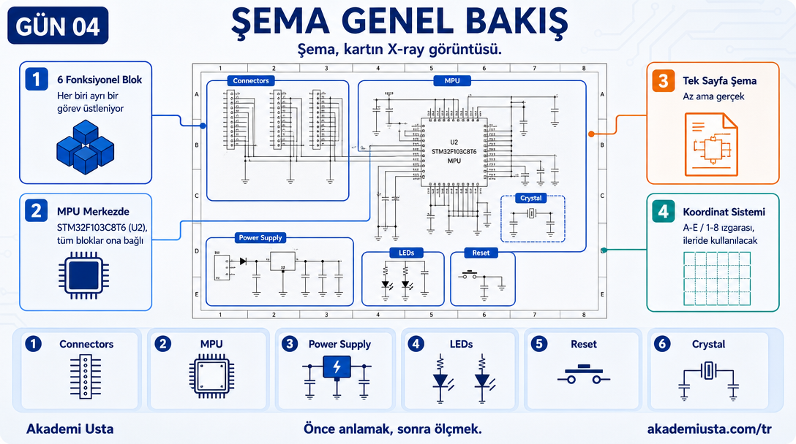
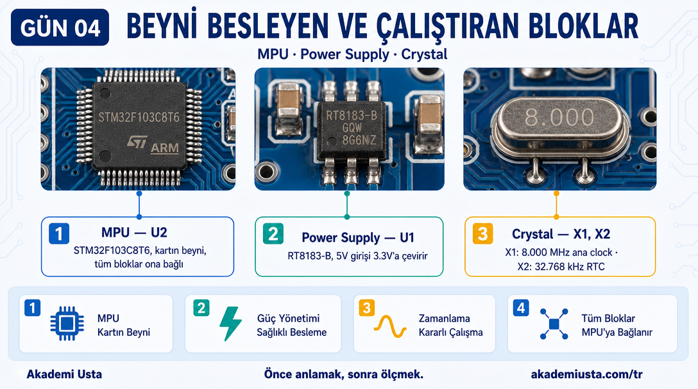
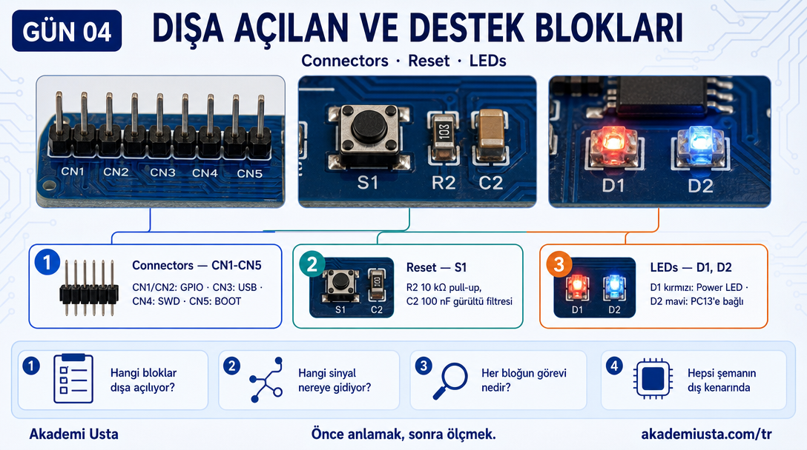
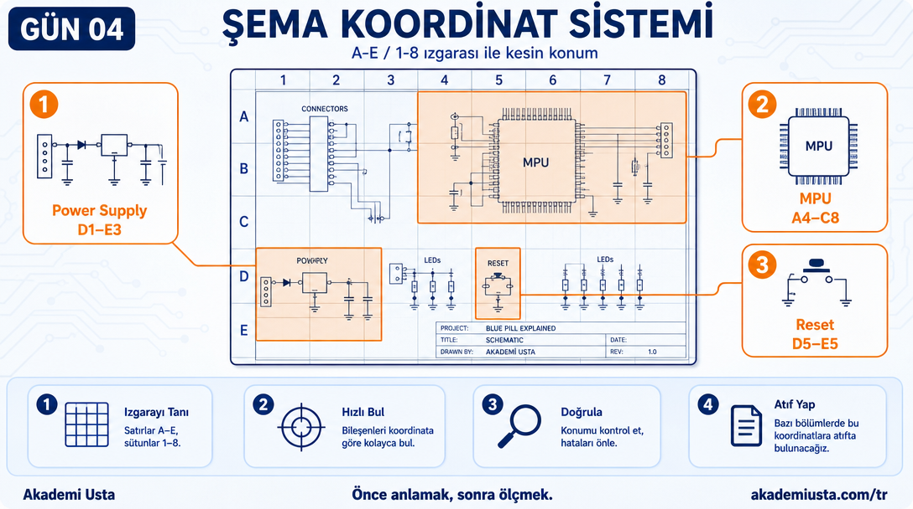
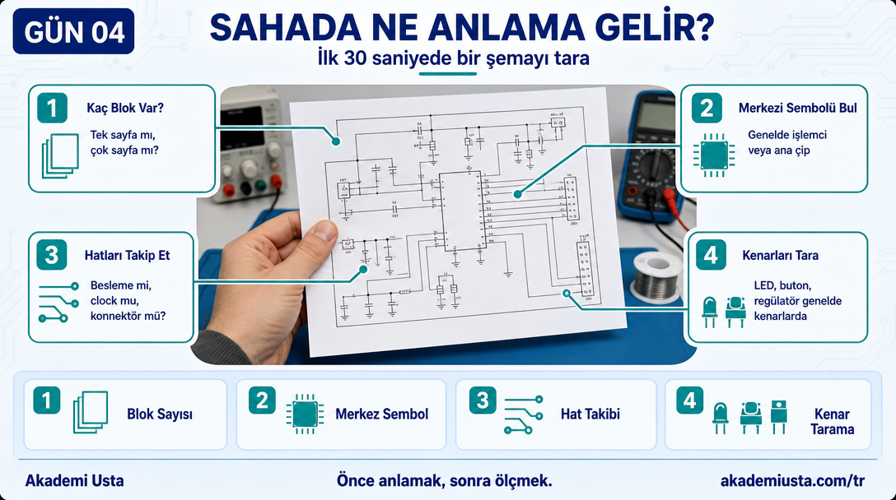

# Bölüm 04 — Şema Genel Bakış

> *Şema, kartın X-ray görüntüsü.*



---

## Blue Pill Şeması


Bu şema tek sayfa. İyi haber: az ama gerçek.

---

## Şemada Kaç Blok Var?

Yukarıdaki PCB şemasına baktığımızda 5 kutulanmış blok görüyoruz: Connectors, MPU, Power Supply, LEDs, Reset. Buna bir de kutusu olmayıp MPU'nun içinde duran Crystal'i (X1, X2) mantıksal bir 6. grup olarak eklersek, toplam 6 işlev grubu çıkar. Her biri ayrı bir işlev üstleniyor.

```
┌─────────────────────────────────────────────────┐
│                  Blue Pill Şeması               │
│                                                 │
│  ┌──────────┐    ┌──────────────────────────┐   │
│  │Connectors│    │         MPU              │   │
│  │ CN1–CN5  │    │   STM32F103C8T6 (U2)    │   │
│  └──────────┘    └──────────────────────────┘   │
│                                                 │
│  ┌──────────┐    ┌──────────┐  ┌────────────┐   │
│  │  Power   │    │  LEDs    │  │   Reset    │   │
│  │  Supply  │    │  D1, D2  │  │  S1+R2+C2  │   │
│  │ RT8183-B │    │          │  │            │   │
│  └──────────┘    └──────────┘  └────────────┘   │
│                                                 │
│         (Crystal X1 ve X2 — MPU yanında)        │
└─────────────────────────────────────────────────┘
```

---

## Karşılaştırma: Çipin Kendi İç Mimarisi


Bu görsel PCB şeması değil — çipin datasheet'teki iç mimari blok diyagramı (Figure 1). Kartın üstündeki 6 fiziksel bloktan tamamen farklı bir şey gösteriyor: çipin **içinde** onlarca alt blok var (CPU, Flash, SRAM, GPIOA-E, TIM1-4, USART, SPI, I2C, ADC...).

Dikkat: bu diyagram STM32F103**x8/xB** ailesinin genelini gösteriyor — üstünde yazan "Flash 128 KB" **xB** varyantına ait. Bizim karttaki C8T6'da bu **64 KB**'dir (Bölüm 03'te part number'dan okumuştuk). Datasheet'te tek bir diyagram tüm aileyi kapsadığı için böyle; kendi kartındaki gerçek değeri her zaman part number'dan okuyacağız, bu genel diyagramdan değil.

---

## Her Bloğun Görevi





### 1. MPU — U2 (STM32F103C8T6)
Kartın beyni. İşlemcinin kendisi.
Şemada merkezdedir. Tüm diğer bloklar ona bağlıdır.

**Bu seride en çok bu bloğa bakacağız.**

---

### 2. Power Supply — U1 (RT8183-B)
USB'den veya 5V girişten gelen gerilimi 3.3V'a çeviriyor.
İşlemci 3.3V ile çalışıyor. Bu devre olmadan işlemci besleme alamaz.

**Bölüm 05'te tam analiz yapacağız.**

---

### 3. Connectors — CN1, CN2, CN3, CN4, CN5
İşlemcinin pinleri dışarıya bu konnektörler üzerinden çıkıyor.
CN1 ve CN2: GPIO pinleri
CN4: SWD (programlama)
CN3: USB
CN5: BOOT

**Bölüm 08'de pin-pin inceleyeceğiz.**

---

### 4. Crystal — X1 ve X2
X1: 8.000 MHz — işlemcinin ana clock'u
X2: 32.768 kHz — RTC (gerçek zamanlı saat) için

**Bölüm 06'da clock sistemini anlatırken bu iki kristali tam okuyacağız.**

---

### 5. Reset — S1 + R2 + C2
S1: Reset butonu
R2 (10 kΩ): NRST pinini 3.3V'a bağlayan pull-up direnci
C2 (100 nF): Gürültü filtreleme kapasitörü

**Bölüm 07'de reset devresini okuyacağız.**

---

### 6. LEDs — D1 (Red) + D2 (Blue)
İki LED var.
D1 (kırmızı): Power LED — kart beslendiğinde yanar
D2 (mavi): PC13 pinine bağlı — yazılımdan kontrol edilebilir

R1 ve R5 (510 Ω): Akım sınırlama dirençleri.

---

## Şemayı Okuma Sırası

Şimdi 6 bloğun ne olduğunu biliyoruz.

Bundan sonraki bölümlerde her bloğu tek tek açacağız:

```
Bölüm 05 → Power Supply (RT8183-B ve besleme devresi)
Bölüm 06 → Clock (X1, X2, PLL)
Bölüm 07 → Reset + Boot (S1, R2, C2, BOOT0, BOOT1)
Bölüm 08 → MPU + Pinout (U2 ve tüm pinler)
Bölüm 09 → GPIO + Alternate Function
...
Bölüm 12 → Şema baştan sona (hepsi birlikte)
```

---

## Şema Koordinat Sistemi



Bu şema bir koordinat sistemi kullanıyor.

Yatayda 1–8, dikeyde A–E harfleri var.

Şemada bir bileşeni belirtmek için:
- Power Supply → **D1–E3**
- MPU → **A4–C8**
- Reset → **D5–E5**

Bazı bölümlerde bu koordinatlara atıfta bulunacağız.

---

## Sahada Ne Anlama Gelir?



Elinde hiç görmediğin bir şema var. İlk 30 saniyede ne yaparsın?

```
Adım 1: Kaç sayfa/blok var? Tek sayfa mı, çok sayfa mı?
Adım 2: En büyük/merkezi sembolü bul — genelde işlemci veya ana çip odur.
Adım 3: O sembole giren/çıkan hatları takip et: hangisi besleme,
        hangisi clock, hangisi konnektör?
Adım 4: Küçük periferik blokları (LED, buton, regülatör) kenarlarda ara —
        genelde ana çipin etrafında dururlar.
```

Bu sırayla taranan bir şema artık kaotik bir çizim değil, tanıdık bir yapı. Blue Pill'de 6 blok bulduk; başka bir kartta blok sayısı değişir ama tarama mantığı aynı kalır.

---

## Sonraki bölüm

**[05 — Power Supply](../05-power-supply/README.md)**
