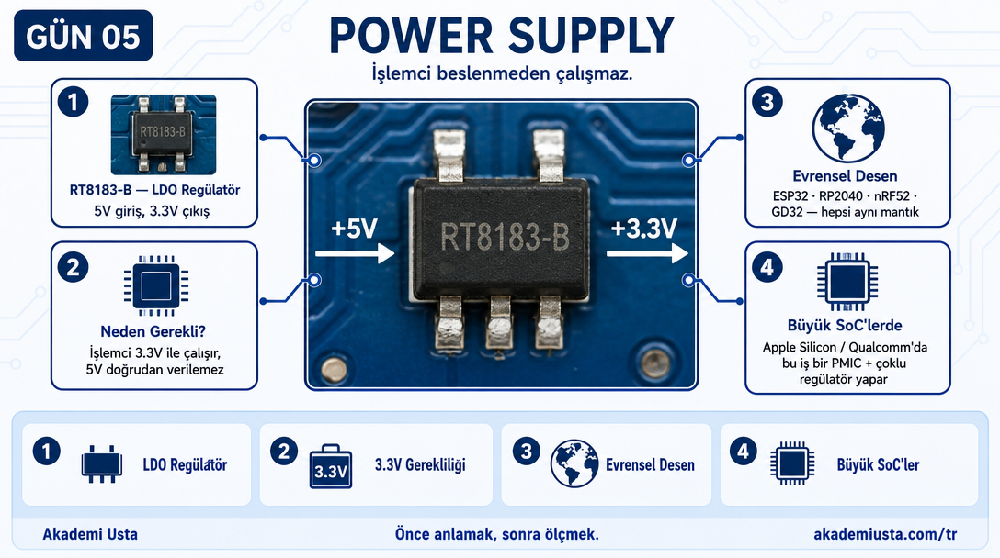
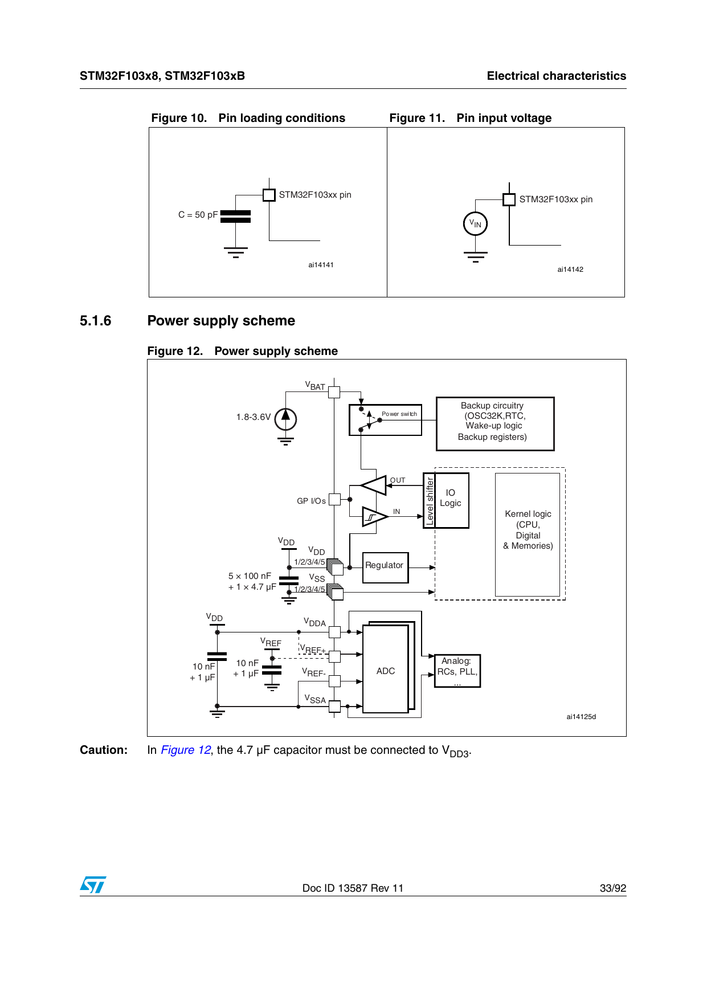
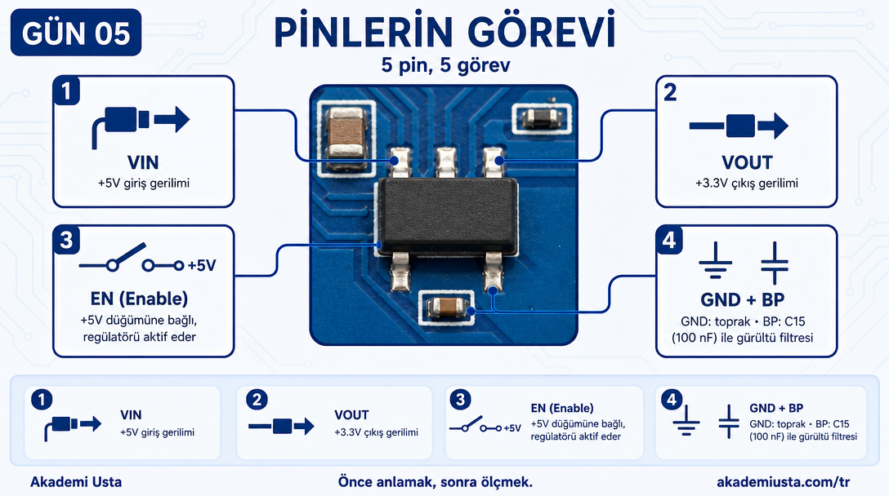
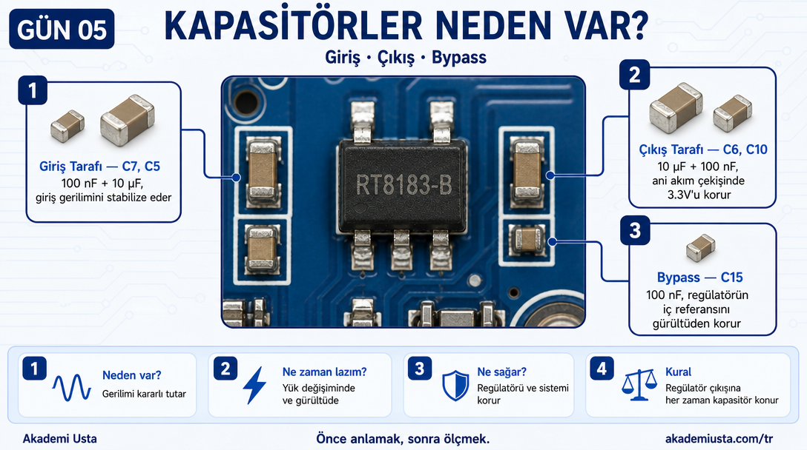
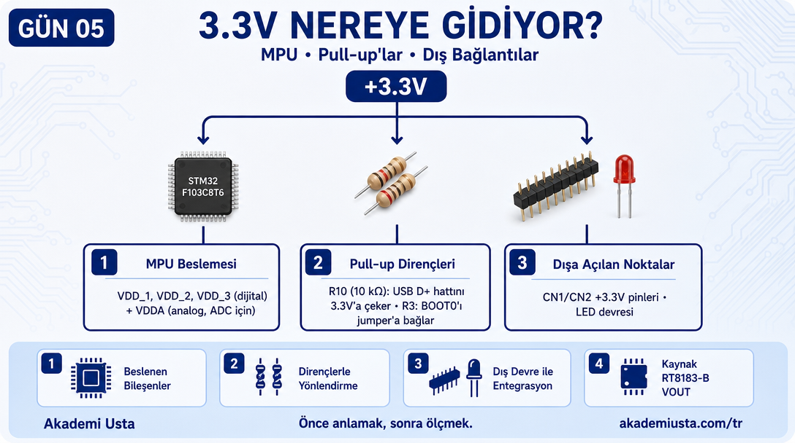
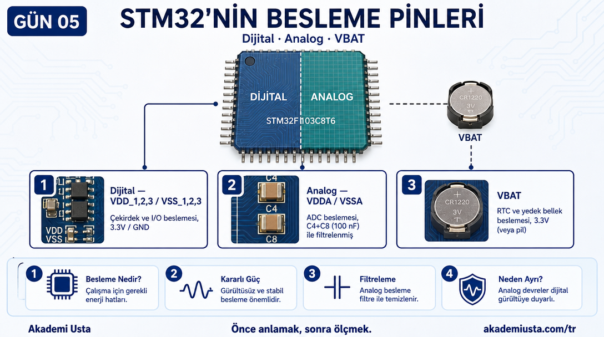
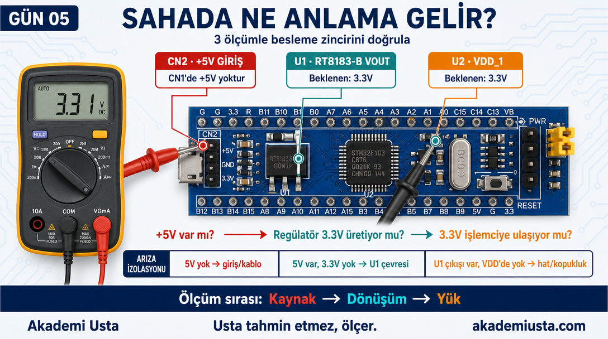

# Bölüm 05 — Power Supply

> *İşlemci beslenmeden çalışmaz. Ama her şey aynı gerilimde çalışmaz.*



---

> **Bu bölümde öğrendiğin şey şurada da geçerli:**
> ✓ ESP32 ✓ RP2040 ✓ nRF52 ✓ GD32 — hepsi harici gerilimi bir regülatörden
>   geçirip çekirdeğe verir, tıpkı Blue Pill'deki RT8183-B gibi.
> ✓ Apple Silicon / Qualcomm gibi büyük SoC'lerde bu zincir bir PMIC ve
>   birden fazla regülatörle çoklu güç alanını (power domain) besler —
>   yapı karmaşıklaşır ama temel takip aynı kalır: harici enerji hangi
>   aşamalardan geçerek çekirdeğin çalışma gerilimine dönüşüyor?

---

## Şemada Power Supply Bloğu

Şemada sol alt köşe — **D1–E3 koordinatları**.



```
+5V ──┬── C7(100n) ─── GND
      │
      └── C5(10u) ──── GND
      │
      └── U1 (RT8183-B)
           VIN  → +5V
           GND  → GND
           EN   → (enable — aktif)
           BP   → C15(100n) → GND
           VOUT → +3.3V ──┬── C6(10u) ── GND
                          └── C10(100n) ─ GND
```

---

## RT8183-B Nedir?

RT8183-B bir **LDO regülatör** (Low Dropout Regulator).

Görevi:
```
5V giriş → 3.3V çıkış
```

STM32F103 3.3V ile çalışıyor. USB'den gelen 5V veya harici 5V kaynağı doğrudan işlemciye verilemez — işlemci hasar görür.

RT8183-B bu dönüşümü yapıyor.

---

## Pinlerin Görevi



| Pin | Bağlantı | Görevi |
|---|---|---|
| VIN | +5V | Giriş gerilimi |
| GND | GND | Toprak |
| EN | Açık (pulled high) | Enable — regülatörü aktif eder |
| BP | C15 (100nF) → GND | Bypass kapasitörü — gürültü filtresi |
| VOUT | +3.3V hattı | Çıkış gerilimi |

---

## Kapasitörler Neden Var?



Şemada 5 kapasitör görüyoruz. Neden bu kadar?

**C7 ve C5 (giriş tarafı):**
Giriş gerilimini stabilize ediyor. USB hattındaki anlık gerilim düşüşlerini filtreler.

**C6 ve C10 (çıkış tarafı):**
3.3V hattını stabilize ediyor. İşlemci aniden yüksek akım çektiğinde gerilim düşmesin diye.

**C15 (bypass pini):**
RT8183-B'nin dahili referans devresini gürültüden koruyor.

**Kural:** Regülatör çıkışına her zaman kapasitör koyulur. Datasheet'te minimum değerler belirtilir.

---

## 3.3V Nereye Gidiyor?



Şemada 3.3V çıkışını takip edersek:

```
RT8183-B VOUT (+3.3V)
│
├── U2 VDD_1, VDD_2, VDD_3 pinleri (MPU dijital besleme)
├── U2 VDDA pini (MPU analog besleme — ADC için)
├── R10 (USB D+ pull-up direnci, 10 kΩ — R9/R11 sadece USBDM/USBDP hattında 22 Ω'luk seri dirençler, 3.3V'a bağlı değiller)
├── R3 (100 kΩ — BOOT0 pinini CN5 jumper'ının ortak ucuna bağlayan seri direnç; jumper +3.3V tarafına takılırsa BOOT0 çekilir)
├── CN1/CN2 +3.3V pinleri (dışarıya çıkış)
└── LED devresi
```

---

## STM32'nin Besleme Pinleri



İşlemcide tek bir besleme pini yok. Birden fazla:

| Pin | Gerilim | Görevi |
|---|---|---|
| VDD_1, VDD_2, VDD_3 | 3.3V | Dijital çekirdek ve I/O beslemesi |
| VDDA | 3.3V | Analog devre beslemesi (ADC) |
| VBAT | 3.3V (veya pil) | RTC ve yedek bellek |
| VSS_1, VSS_2, VSS_3 | GND | Dijital toprak |
| VSSA | GND | Analog toprak |

Neden ayrı besleme? Analog devreler dijital gürültüye duyarlı. ADC'nin doğru ölçüm yapması için analog beslemesi dijital beslemeden fiziksel olarak ayrılmış.

Şemada **C4 (100nF) ve C8 (100nF)** VDDA pininin yanında — analog besleme filtresi.

---

## Sahada Ne Anlama Gelir?



Kart açılmıyor. Nereden başlarsın?

```
Adım 1: +5V girişi var mı?
  → CN2 üzerindeki 5V pinini ölç (CN1'de +5V yok, sadece +3.3V/GND).

Adım 2: RT8183-B çıkışı 3.3V veriyor mu?
  → VOUT pinini ölç.

Adım 3: İşlemcinin VDD pini 3.3V görüyor mu?
  → U2'nin VDD_1 pinini ölç.
```

3 ölçümle besleme zinciri doğrulanıyor. Sorun burada değilse bir sonraki bloğa geçilir.

---

## Sonraki bölüm

**[06 — Clock Sistemi](../06-clock-sistemi/README.md)**
