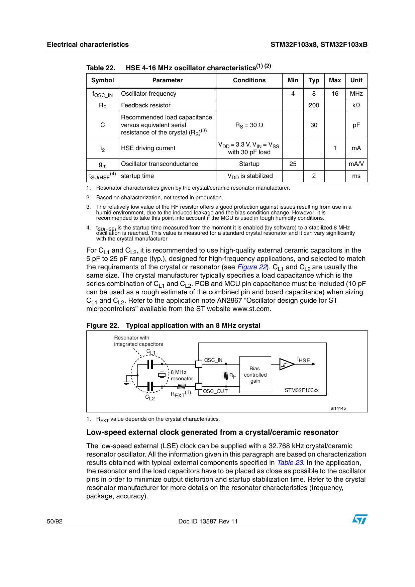
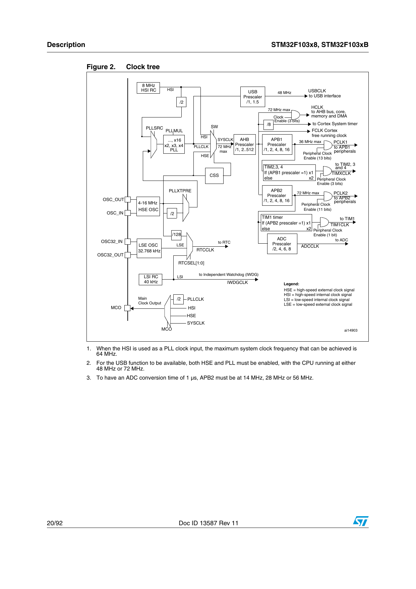

# Bölüm 06 — Clock Sistemi

> *Clock olmadan işlemci çalışmaz. Her şeyin ritmi buradan geliyor.*

---

> **Bu bölümde öğrendiğin şey şurada da geçerli:**
> ✓ ESP32 ✓ RP2040 ✓ nRF52 ✓ GD32
> ✓ Hatta Apple Silicon / Qualcomm SoC'ler — hepsinde bir kristal veya
>   dahili osilatör önce ham bir frekans üretir, PLL onu katlar. Sayılar
>   değişir, "kristal → PLL → sistem clock" zinciri değişmez.

---

## Clock Nedir?

İşlemci her işlemi bir clock darbesinde yapar.

72 MHz clock = saniyede 72 milyon darbe.

Her darbede:
- Bir komut çalıştırılabilir
- Bir veri taşınabilir
- Bir sayaç ilerleyebilir

Clock durdu → işlemci durdu.

---

## Şemada Crystal Nerede?



Mpu bloğunun sağ tarafında — **B6 koordinatı**.

```
X1 (8 MHz crystal)
  OSC_IN  (PD0 pini) ──── X1 ──── OSC_OUT (PD1 pini)
                                   │
                            C13(12p)  C14(12p)
                                   │
                                  GND
```

```
X2 (32.768 kHz crystal)
  OSC32_IN  (PC14 pini) ──── X2 ──── OSC32_OUT (PC15 pini)
                             │
                      C9(100p)  C12(100p)
                             │
                            GND
```

---

## İki Crystal, İki Farklı Amaç

| Crystal | Frekans | Bağlı Olduğu Pin | Görevi |
|---|---|---|---|
| X1 | 8 MHz | OSC_IN / OSC_OUT | Ana işlemci clock'u |
| X2 | 32.768 kHz | OSC32_IN / OSC32_OUT | RTC (gerçek zamanlı saat) |

---

## Yük Kapasitörleri Neden Var?

X1'in iki yanında C13 ve C14 var (12 pF).
X2'nin iki yanında C9 ve C12 var (100 pF).

Bu kapasitörler crystal'ın doğru frekansa oturması için gerekli.

Crystal üreticisi datasheet'inde "load capacitance" değeri verir.
Bu değer şemadaki kapasitörlerle karşılanır.

**Yanlış kapasitör = yanlış frekans = sistem çalışmaz.**

Şemada not düşülmüş: *"Values of capacitors are estimated"*
Bu Blue Pill'in bilinen bir kısıtı — kapasitör değerleri tam hesaplanmamış.

---

## STM32 Clock Kaynakları



İşlemcide birden fazla clock kaynağı var:

```
HSE (High Speed External)
  → X1 crystal — 4-16 MHz arası
  → En hassas kaynak, PLL için tercih edilen

HSI (High Speed Internal)
  → Dahili RC osilatör — 8 MHz
  → Fabrika kalibrasyonlu ama sıcaklıkla kayar
  → Crystal olmadan çalışmak için

PLL (Phase Locked Loop)
  → HSE veya HSI'dan beslenir
  → Frekansı katlar: 8 MHz × 9 = 72 MHz
  → İşlemci bu clock'la çalışır

LSE (Low Speed External)
  → X2 crystal — 32.768 kHz
  → RTC için kullanılır

LSI (Low Speed Internal)
  → Dahili 40 kHz RC osilatör
  → Watchdog timer için
```

---

## Blue Pill'de Clock Nasıl Akıyor?

```
X1 (8 MHz)
    ↓
HSE
    ↓
PLL × 9
    ↓
72 MHz → SYSCLK (sistem clock'u)
    ↓
AHB Bus → 72 MHz
    ↓
APB1 Bus → 36 MHz (USART, SPI, I2C, Timer burada)
APB2 Bus → 72 MHz (GPIO, ADC, SPI1 burada)
```

---

## Sahada Ne Anlama Gelir?

**Durum 1:** Kart açılmıyor, besleme doğru.

Şüphe: Clock gelmiyor olabilir.

Kontrol:
- X1 kristali yerinde mi?
- Kristal yanında kapasitörler var mı?
- OSC_IN ve OSC_OUT pinlerinde osiloskopla dalga var mı?

**Durum 2:** Zaman saati (RTC) kayıyor.

Şüphe: X2 kristali hatalı veya kapasitörleri yanlış.

Kontrol:
- X2 (32.768 kHz) kristali yerinde mi?
- C9 ve C12 değerleri doğru mu?

---

## Sonraki bölüm

**[07 — Reset ve Boot](../07-reset-ve-boot/README.md)**
