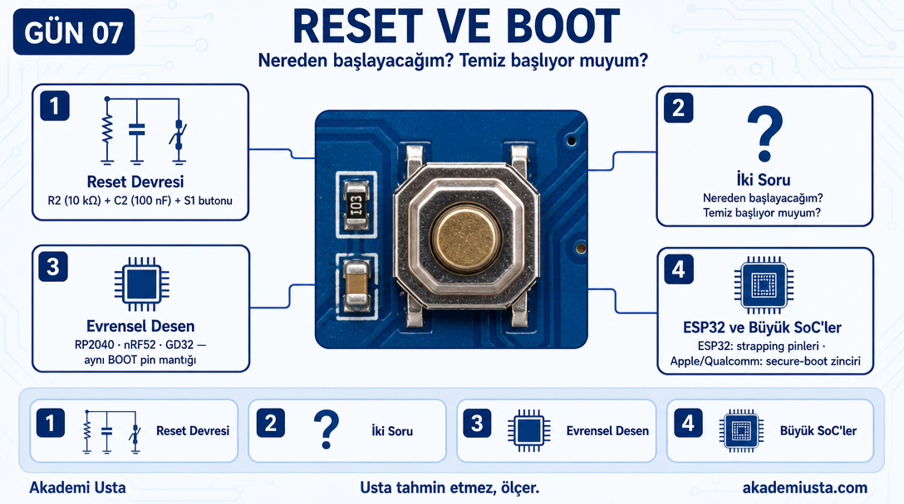
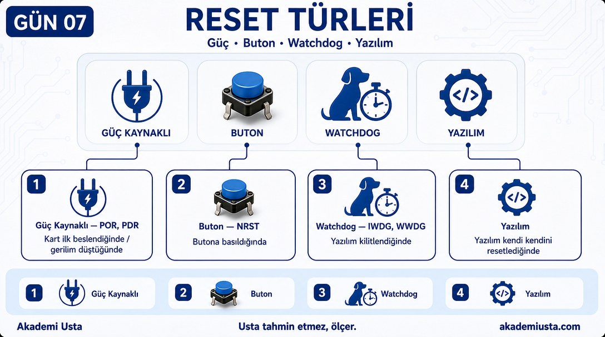
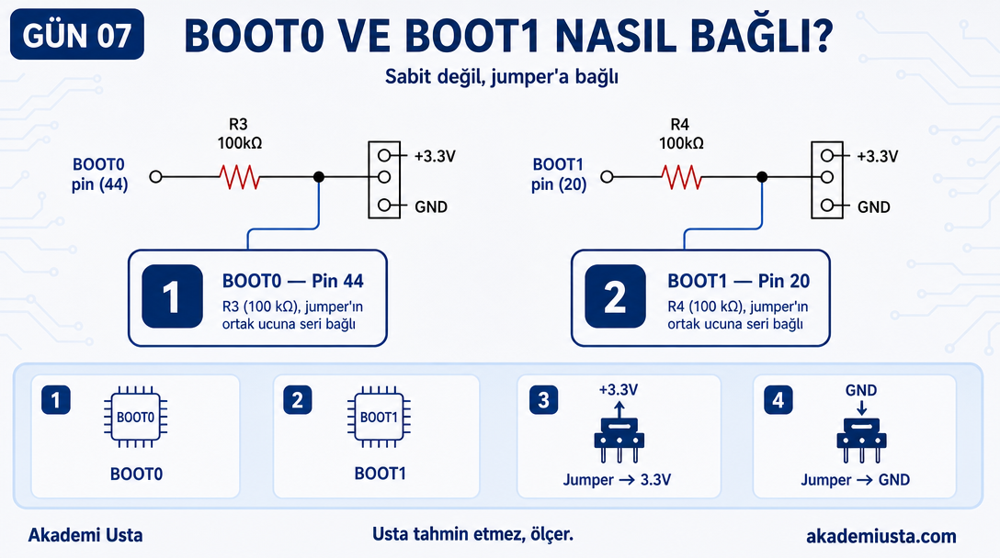
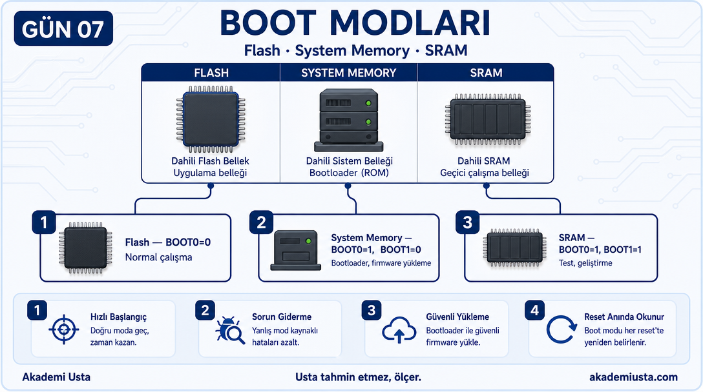
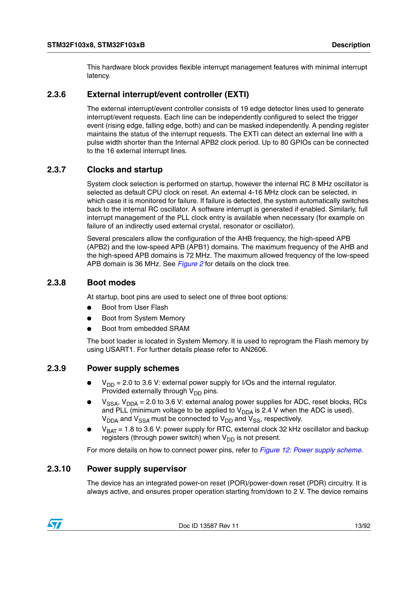
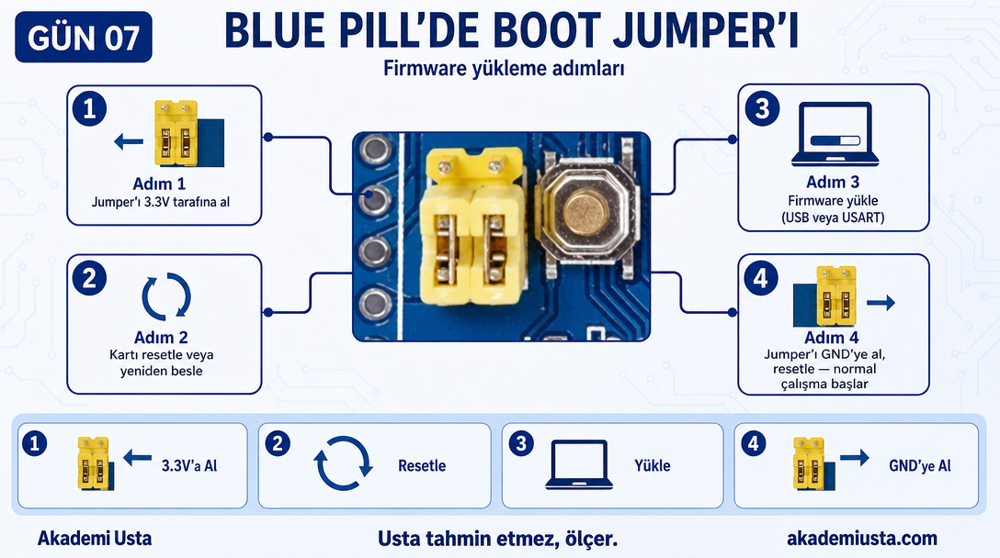
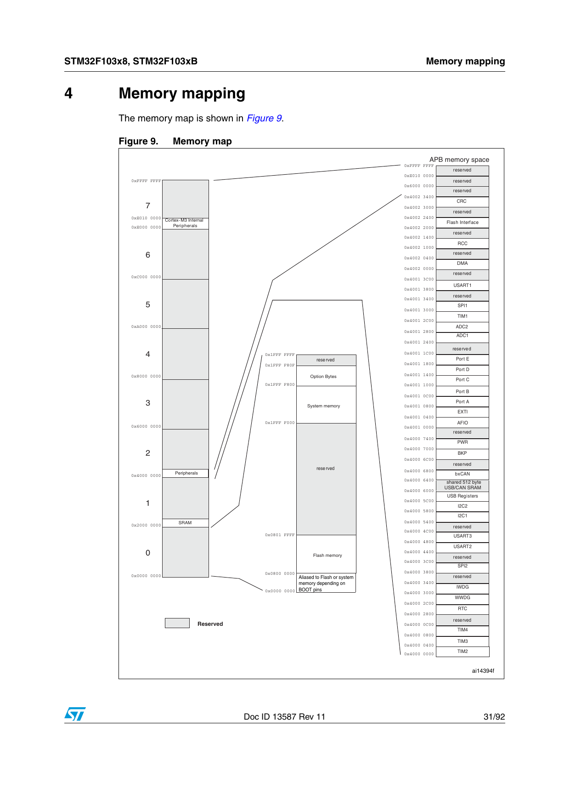
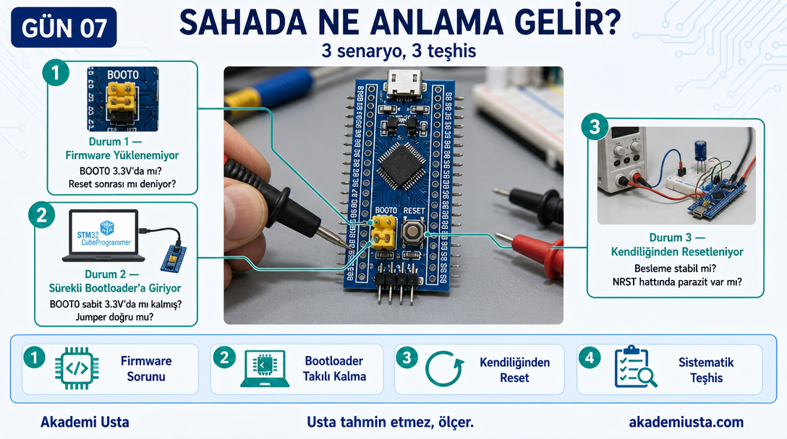

# Bölüm 07 — Reset ve Boot

> *İşlemci her açılışta iki şeye bakar: Nereden başlayacağım? Temiz başlıyor muyum?*



---

> **Bu bölümde öğrendiğin şey şurada da geçerli:**
> ✓ RP2040 ✓ nRF52 ✓ GD32 — ARM Cortex-M ailesindeki her işlemci reset
>   sonrası "hangi bellekten başlayacağım?" sorusunu belirli pinlerin
>   durumuna bakarak cevaplar.
> ✓ ESP32 da aynı prensibi kullanır (strapping pinleriyle boot modu
>   seçimi) ama farklı bir çekirdek mimarisine (Xtensa/RISC-V) sahiptir —
>   kavram aynı, mimari farklı. (Büyük uygulama işlemcileri — Apple,
>   Qualcomm, Intel — çok katmanlı secure-boot zincirleri kullanır, bu
>   basit BOOT pin mantığıyla birebir aynı değildir.)

---

## Şemada Reset Bloğu

Şemada sağ alt — **D5–E5 koordinatı**.

```
+3.3V
  │
  R2 (10kΩ)
  │
  ├──── NRST pini (U2, işlemci)
  │
  C2 (100nF)
  │
  S1 (buton) ──── GND
```

---

## Reset Devresi Nasıl Çalışıyor?

Normal çalışmada:
- R2 NRST pinini 3.3V'da tutuyor (HIGH)
- İşlemci çalışıyor

Butona basıldığında:
- S1 NRST'yi doğrudan GND'ye bağlıyor (LOW)
- İşlemci reset durumuna giriyor
- Buton bırakıldığında R2 pini tekrar 3.3V'a çekiyor
- İşlemci yeniden başlıyor

**C2 (100nF) neden var?**
Buton mekanik titreme (bounce) yapar. Bir kez basıldığında elektriksel olarak onlarca kez açılıp kapanabilir. C2 bu titremeleri yumuşatıyor, işlemci tek bir reset alıyor.

---

## Reset Türleri



Sadece buton değil — STM32'de birden fazla reset kaynağı var:

| Reset Türü | Kısaltma | Neden Oluşur |
|---|---|---|
| Power-On Reset | POR | Kart ilk beslendiğinde |
| Power-Down Reset | PDR | Gerilim belirli bir eşiğin altına düştüğünde |
| External Reset | NRST | Butona basıldığında |
| Watchdog Reset | IWDG/WWDG | Yazılım kilitlendiğinde |
| Software Reset | — | Yazılım kendi kendini resetlediğinde |

**Not:** Datasheet'te ayrı bir "Brown-out Reset (BOR)" tanımı yok (bazı diğer MCU ailelerinde bu isimle geçer). STM32F103'te gerilim düşüşü PDR tarafından karşılanır. Ayrıca bir de **PVD** (Programmable Voltage Detector) var — ama bu otomatik bir reset ÜRETMEZ, gerilim ayarlanan bir eşiğin altına/üstüne çıktığında yazılıma bir interrupt gönderir; reset yapıp yapmamaya yazılım kendisi karar verir.

Sahada "cihaz kendiliğinden resetleniyor" şikayeti geldiğinde bu liste akılda olmalı.

---

## Boot Sistemi

Reset sonrasında işlemci şu soruyu sorar:

> **"Nereden başlayacağım?"**

Bu sorunun cevabı BOOT0 ve BOOT1 pinlerinin durumuna göre belirlenir.

---

## Şemada BOOT Pinleri



Şemada iki ayrı yerde:

**BOOT0:**
```
BOOT0 pini (U2, pin 44) ──── R3 (100kΩ) ──── CN5 jumper (ortak uç)
                                              │         │
                                          +3.3V (pin 1)  GND (pin 5)
```
R3, +3.3V'a sabit bağlı bir pull-up DEĞİL — pin 44 ile jumper'ın ortak ucu arasında bir seri direnç. +3.3V ve GND, jumper'ın kendisine (R3'süz) doğrudan bağlı; jumper hangi tarafa takılıysa BOOT0 o gerilimi görür.

**BOOT1:**
```
BOOT1 pini (PB2, pin 20) ──── R4 (100kΩ) ──── CN5 jumper (ortak uç)
                                              │         │
                                          +3.3V (pin 2)  GND (pin 6)
```
Aynı mantık: R4 de sabit bir pull-down değil, pin 20 ile jumper'ın ortak ucu arasında seri bir direnç.

---

## Boot Modları





| BOOT0 | BOOT1 | Nereden Başlanır | Kullanım |
|---|---|---|---|
| 0 (GND) | x | Flash | Normal çalışma |
| 1 (3.3V) | 0 (GND) | System Memory | Bootloader — firmware yükleme |
| 1 (3.3V) | 1 (3.3V) | SRAM | Test, geliştirme |

**System Memory nedir?**
STM32'nin içinde fabrikadan gelen bir bootloader var. Bu mod seçildiğinde işlemci USB veya USART üzerinden firmware almaya hazır hale gelir.

---

## Blue Pill'de Boot Jumper'ı



CN5 konnektörü BOOT0 seçimi için:

```
Jumper GND tarafına takılıysa → BOOT0 = GND → Flash'tan başla (normal)
Jumper 3.3V tarafına takılıysa → BOOT0 = 3.3V → Bootloader'a gir
```

**Not:** Kartın üzerindeki jumper'ın fiziksel silkscreen pin numaraları (1-2 / 2-3 gibi) elimizdeki şema veya fotoğraflarda doğrulanamadı — kesin pozisyon için kartındaki "BOOT0" yazısının yanındaki 3 pinlik başlığa bak, hangi ucun "GND" hangi ucun "3.3V" tarafında olduğunu multimetreyle doğrula.

Firmware yükleme süreci:
```
1. BOOT0 jumper'ını 3.3V tarafına al
2. Kartı resetle veya yeniden besle
3. Firmware yükle (USB veya USART üzerinden)
4. BOOT0 jumper'ını GND tarafına al
5. Kartı resetle — normal çalışma başlar
```

---

## Memory Map



İşlemcinin bellek haritası (Memory Map), hangi donanımın hangi adreste olduğunu gösterir. Yazılım geliştirirken, özellikle register seviyesinde programlama yaparken bu harita çok kritiktir.

---

## Sahada Ne Anlama Gelir?



**Durum 1:** Firmware yüklenemiyor.

Kontrol:
- BOOT0 pini 3.3V'da mı? (System Memory modu için gerekli)
- Reset sonrası mı deniyorsun? (Boot modu reset anında okunur)

**Durum 2:** Kart her seferinde bootloader'a giriyor, normal çalışmıyor.

Kontrol:
- BOOT0 pini sabit 3.3V'da mı kalmış?
- Jumper doğru pozisyonda mı?

**Durum 3:** Kart ara ara kendiliğinden resetleniyor.

Kontrol:
- Besleme 3.3V stabil mi? (PDR tetikleniyor olabilir)
- NRST hattında parazit var mı?

---

## Sonraki bölüm

**[08 — MPU ve Pinout](../08-mpu-ve-pinout/README.md)**
