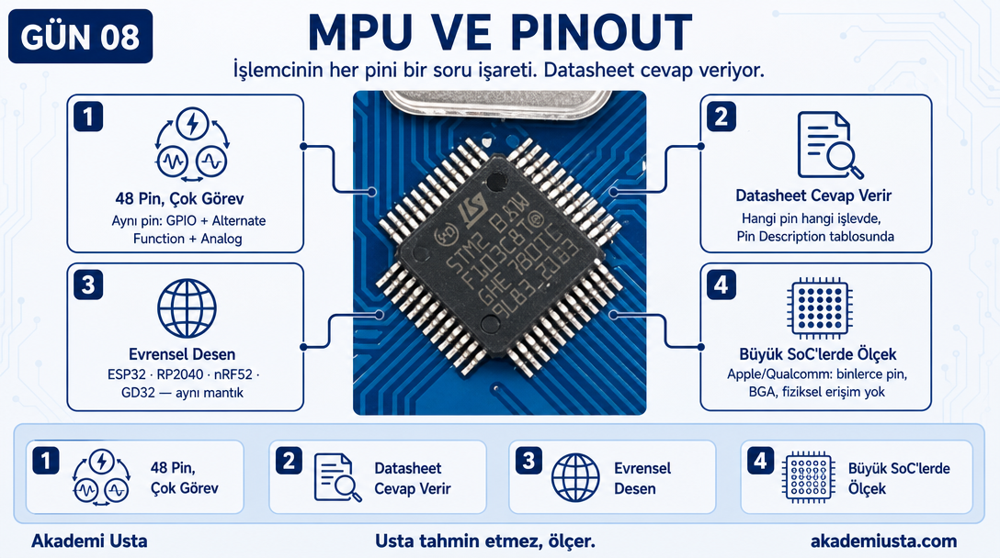
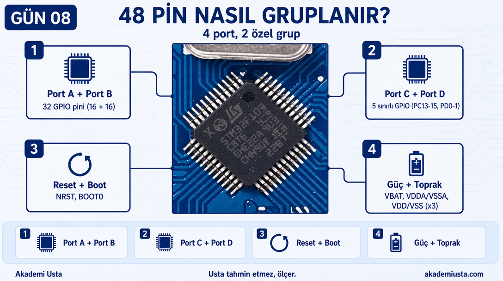
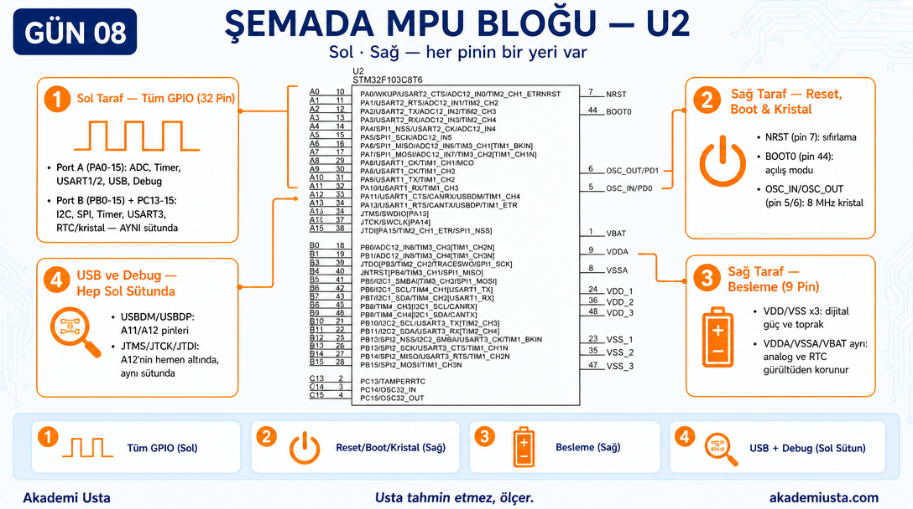
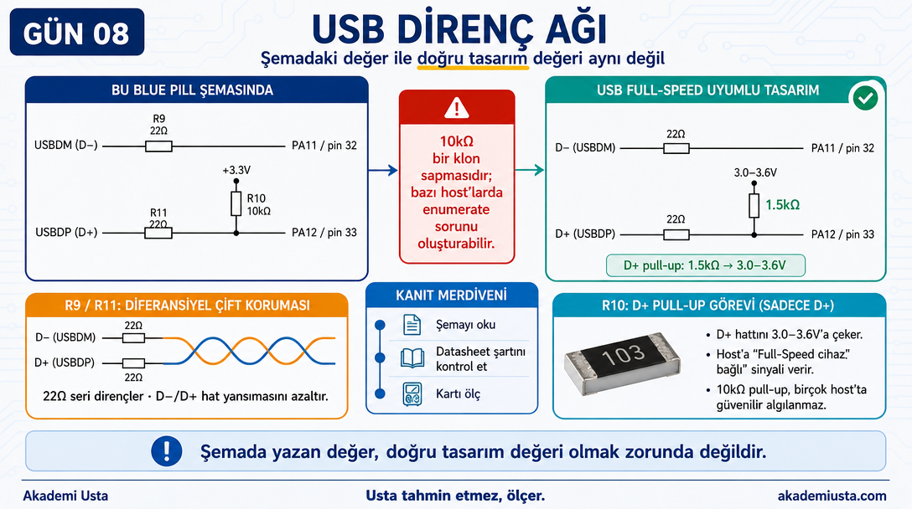
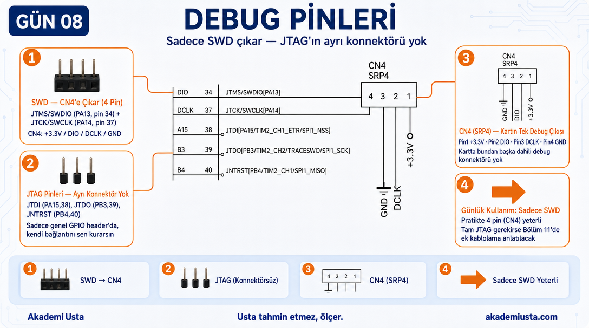
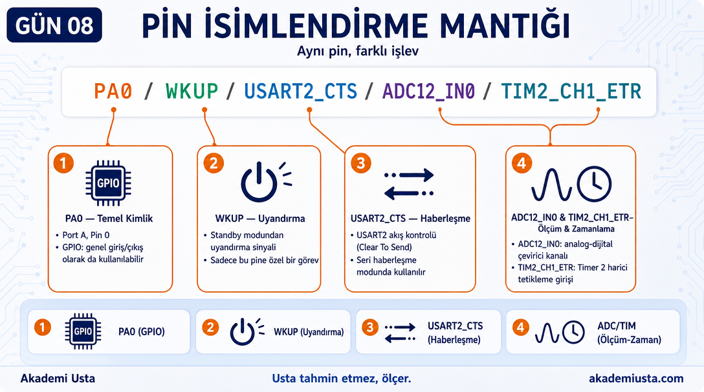
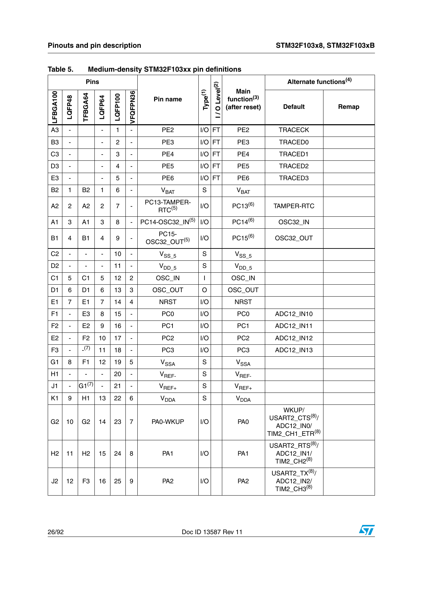
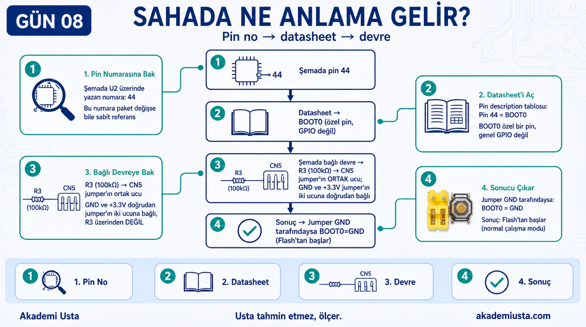

# Bölüm 08 — MPU ve Pinout

> *İşlemcinin her pini bir soru işareti. Datasheet cevap veriyor.*



---

> **Bu bölümde öğrendiğin şey şurada da geçerli:**
> ✓ ESP32 ✓ RP2040 ✓ nRF52 ✓ GD32 — her mikrodenetleyicide pin sayısı sabit
>   ama her pinin birden fazla görevi vardır, datasheet'teki pin tablosu
>   hangi görevin nerede olduğunu söyler. (Apple/Qualcomm gibi büyük SoC'lerde
>   pin sayısı binlerle ölçülür ve BGA paketlerde fiziksel erişim yoktur —
>   mantık aynı ama ölçek çok farklıdır.)

---

## Pinout Kartı


Bu görsel Blue Pill'in tüm pinlerini gösteriyor.

Soldaki ve sağdaki sıralar: GPIO ve alternate function etiketleri.
Üstte: SWD (programlama) pinleri.
Ortada: Kartın kendisi.

---

## STM32F103C8T6 — 48 Pin



İşlemcinin 48 pini var. Ama hepsi farklı işler yapabiliyor.

Pin grupları:

```
Port A (PA0–PA15)   → 16 pin
Port B (PB0–PB15)   → 16 pin
Port C (PC13–PC15)  → 3 pin
Port D (PD0–PD1)    → 2 pin (crystal pinleri)

Özel pinler:
NRST    → Reset
BOOT0   → Boot modu seçimi
VBAT    → RTC beslemesi
VDD     → Dijital besleme (x3)
VDDA    → Analog besleme
VSS     → Dijital toprak (x3)
VSSA    → Analog toprak
```

---

## Şemada MPU Bloğu — U2



Şemada U2 sembolü işlemciyi temsil ediyor.

Sol taraf pinleri (tüm GPIO — Port A + Port B + PC13-15, tek sütun):
```
A0–A15: PA0 – PA15 pinleri
B0–B15: PB0 – PB15 pinleri
C13–C15: PC13 – PC15 pinleri
```

Sağ taraf pinleri (özel pinler + besleme):
```
NRST (pin 7)    → Reset
BOOT0 (pin 44)  → Boot modu seçimi
PD1 (pin 6)     → OSC_OUT (kristal)
PD0 (pin 5)     → OSC_IN (kristal)
VBAT (pin 1)    → 3VB hattı
VDDA (pin 9)    → +3.3V (analog)
VSSA (pin 8)    → GND (analog)
VDD_1 (pin 24)  → +3.3V
VDD_2 (pin 36)  → +3.3V
VDD_3 (pin 48)  → +3.3V
VSS_1 (pin 23)  → GND
VSS_2 (pin 35)  → GND
VSS_3 (pin 47)  → GND
```

Yani Port A ve Port B'nin TAMAMI (32 GPIO) aynı sol sütunda çıkıyor — sağ tarafta GPIO yok,
sadece özel pinler (reset, boot, kristal) ve besleme var. "Üst" diye ayrı bir grup yok, sembolün
sadece sol ve sağ kenarından pin çıkıyor.

---

## USB Pinleri



Şemada U2'nin sol tarafında:

```
USBDM (PA11, pin 32) ──── R9 (22Ω) ──── USB D-
USBDP (PA12, pin 33) ──── R11 (22Ω) ──── USB D+
                                           │
                                      R10 (10kΩ) → +3.3V
```

**R10 (10kΩ) pull-up direnci neden var?**
USB host'a (bilgisayar) "ben buradayım, Full Speed cihazıyım" sinyali veriyor. Bu direnç olmadan USB cihazı algılanmaz.

**Ölç, tahmin etme:** USB 2.0 spesifikasyonu bu direnç için 1.5kΩ ister. Blue Pill klonlarının
çoğunda (bu şema dahil) gerçekte **10kΩ** var — bu, birçok klon kartta bilinen bir sapmadır ve
bazı host'larda USB'nin güvenilir enumerate olmamasına yol açabilir. Şemadaki değer "doğru
olması gereken" değer değil, kartın gerçekte ne yaptığıdır — ikisi ayrı şeydir.

**R9 ve R11 (22Ω) neden var?**
USB hattındaki yansımaları azaltıyor. USB diferansiyel sinyal kullandığından hat empedansı önemli.

---

## Debug Pinleri



Şemada U2'nin sol tarafında:

```
JTMS/SWDIO (PA13, pin 34)  → SWD veri hattı
JTCK/SWCLK (PA14, pin 37)  → SWD clock hattı
JTDI        (PA15, pin 38)  → JTAG veri girişi
JTDO        (PB3,  pin 39)  → JTAG veri çıkışı
JNTRST      (PB4,  pin 40)  → JTAG reset
```

Bunların hepsi CN4'e çıkmıyor. Kartta sadece **JTMS/SWDIO ve JTCK/SWCLK** için ayrılmış,
4 pinli bir SWD konnektörü var:

```
CN4 (SRP4, 4 pin):
Pin 1 → +3.3V
Pin 2 → DIO  (JTMS/SWDIO)
Pin 3 → DCLK (JTCK/SWCLK)
Pin 4 → GND
```

**JTDI, JTDO ve JNTRST için kartta ayrı bir JTAG konnektörü YOK.** Bu 3 pin sadece genel GPIO
header sıralarında (PA15/PB3/PB4 olarak) duruyor — JTAG kullanmak isteyen biri bu pinlere
kendi bağlantısını yapar. Blue Pill'de günlük kullanımda pratikte sadece 4 pinli SWD (CN4)
kullanılır; tam JTAG için ek kablolama gerekir.

Bölüm 11'de detaylı anlatılacak.

---

## Pin İsimlendirme Mantığı





Bir pinin tam adı şöyle okunur:

```
PA0/WKUP/USART2_CTS/ADC12_IN0/TIM2_CH1_ETR
```

Bu tek pinin yapabileceği şeyler:
- `PA0` → Port A, Pin 0 (GPIO)
- `WKUP` → Uyku modundan uyandırma
- `USART2_CTS` → USART2 akış kontrolü
- `ADC12_IN0` → ADC kanal 0
- `TIM2_CH1_ETR` → Timer 2 kanal 1 harici tetikleme

**Aynı pin, farklı modlarda farklı işlev.**

Bunu bir sonraki bölümde "Alternate Function" olarak inceleyeceğiz.

---

## Sahada Ne Anlama Gelir?



Şemada bir pini tanımlamak:

1. Pin numarasına bak (U2 üzerinde yazıyor)
2. Datasheet'teki pin description tablosunu aç
3. O numaradaki pinin adını ve alternate function'larını bul
4. Şemada o pine bağlı devreye bak — mantıklı mı?

Örnek:
```
Şemada pin 44 → BOOT0
Datasheet → Pin 44 = BOOT0 (özel pin, GPIO değil)
Bağlı olan → R3 (100kΩ) üzerinden CN5 jumper'ın ortak ucuna; GND ve 3.3V doğrudan jumper'a bağlı
Sonuç → Jumper GND tarafındaysa BOOT0 = GND (Flash'tan başla)
```

---

## Sonraki bölüm

**[09 — GPIO ve Alternate Function](../09-gpio-ve-alternate-function/README.md)**
