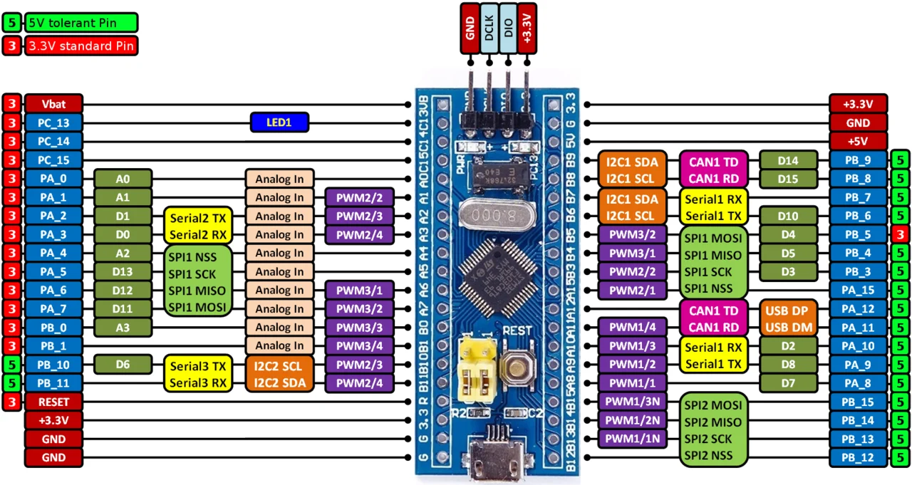

# Bölüm 08 — MPU ve Pinout

> *İşlemcinin her pini bir soru işareti. Datasheet cevap veriyor.*

---

## Pinout Kartı



Bu görsel Blue Pill'in tüm pinlerini gösteriyor.

Soldaki ve sağdaki sıralar: GPIO ve alternate function etiketleri.
Üstte: SWD (programlama) pinleri.
Ortada: Kartın kendisi.

---

## STM32F103C8T6 — 48 Pin

İşlemcinin 48 pini var. Ama hepsi farklı işler yapabiliyor.

Pin grupları:

```
Port A (PA0–PA15)   → 16 pin
Port B (PB0–PB15)   → 16 pin (bazı pinler yok)
Port C (PC13–PC15)  → 3 pin
Port D (PD0–PD1)    → 2 pin (crystal pinleri)

Özel pinler:
NRST    → Reset
BOOT0   → Boot modu seçimi
VBAT    → RTC beslemesi
VDD     → Dijital besleme (x3)
VDDA    → Analog besleme
VSS     → Dijital toprak (x3)
VSSA    → Analog toprak
```

---

## Şemada MPU Bloğu — U2

Şemada U2 sembolü işlemciyi temsil ediyor.

Sol taraf pinleri (Port A):
```
A0–A15: PA0 – PA15 pinleri
```

Sağ taraf pinleri (Port B ve C):
```
B0–B15: PB0 – PB15 pinleri
C13–C15: PC13 – PC15 pinleri
```

Üst taraf (besleme):
```
VBAT (pin 1)    → 3VB hattı
VDDA (pin 9)    → +3.3V (analog)
VSSA (pin 8)    → GND (analog)
VDD_1 (pin 24)  → +3.3V
VDD_2 (pin 36)  → +3.3V
VDD_3 (pin 48)  → +3.3V
VSS_1 (pin 23)  → GND
VSS_2 (pin 35)  → GND
VSS_3 (pin 47)  → GND
```

---

## USB Pinleri

Şemada U2'nin sol tarafında:

```
USBDM (PA11, pin 33) ──── R11 (22Ω) ──── USB D-
USBDP (PA12, pin 34) ──── R10 (22Ω) ──── USB D+
                                           │
                                      R9 (10kΩ) → +3.3V
```

**R9 (10kΩ) pull-up direnci neden var?**
USB host'a (bilgisayar) "ben buradayım, Full Speed cihazıyım" sinyali veriyor. Bu direnç olmadan USB cihazı algılanmaz.

**R10 ve R11 (22Ω) neden var?**
USB hattındaki yansımaları azaltıyor. USB diferansiyel sinyal kullandığından hat empedansı önemli.

---

## Debug Pinleri

Şemada U2'nin sol tarafında:

```
JTMS/SWDIO (PA13, pin 34)  → SWD veri hattı
JTCK/SWCLK (PA14, pin 37)  → SWD clock hattı
JTDI        (PA15, pin 38)  → JTAG veri girişi
JTDO        (PB4,  pin 40)  → JTAG veri çıkışı
JNTRST      (PB4,  pin 41)  → JTAG reset
```

Bu pinler **CN4 (SWD konnektörü)** üzerinden dışarıya çıkıyor.
Bölüm 11'de detaylı anlatılacak.

---

## Pin İsimlendirme Mantığı

Bir pinin tam adı şöyle okunur:

```
PA0/WKUP/USART2_CTS/ADC12_IN0/TIM2_CH1_ETR/NRST
```

Bu tek pinin yapabileceği şeyler:
- `PA0` → Port A, Pin 0 (GPIO)
- `WKUP` → Uyku modundan uyandırma
- `USART2_CTS` → USART2 akış kontrolü
- `ADC12_IN0` → ADC kanal 0
- `TIM2_CH1_ETR` → Timer 2 kanal 1 harici tetikleme

**Aynı pin, farklı modlarda farklı işlev.**

Bunu bir sonraki bölümde "Alternate Function" olarak inceleyeceğiz.

---

## Sahada Ne Anlama Gelir?

Şemada bir pini tanımlamak:

1. Pin numarasına bak (U2 üzerinde yazıyor)
2. Datasheet'teki pin description tablosunu aç
3. O numaradaki pinin adını ve alternate function'larını bul
4. Şemada o pine bağlı devreye bak — mantıklı mı?

Örnek:
```
Şemada pin 44 → BOOT0
Datasheet → Pin 44 = BOOT0 (özel pin, GPIO değil)
Bağlı olan → R3 (100kΩ, GND'ye) ve CN5 jumper
Sonuç → Normal çalışmada BOOT0 = GND (Flash'tan başla)
```

---

## Sonraki bölüm

**[09 — GPIO ve Alternate Function](../09-gpio-ve-alternate-function/README.md)**
