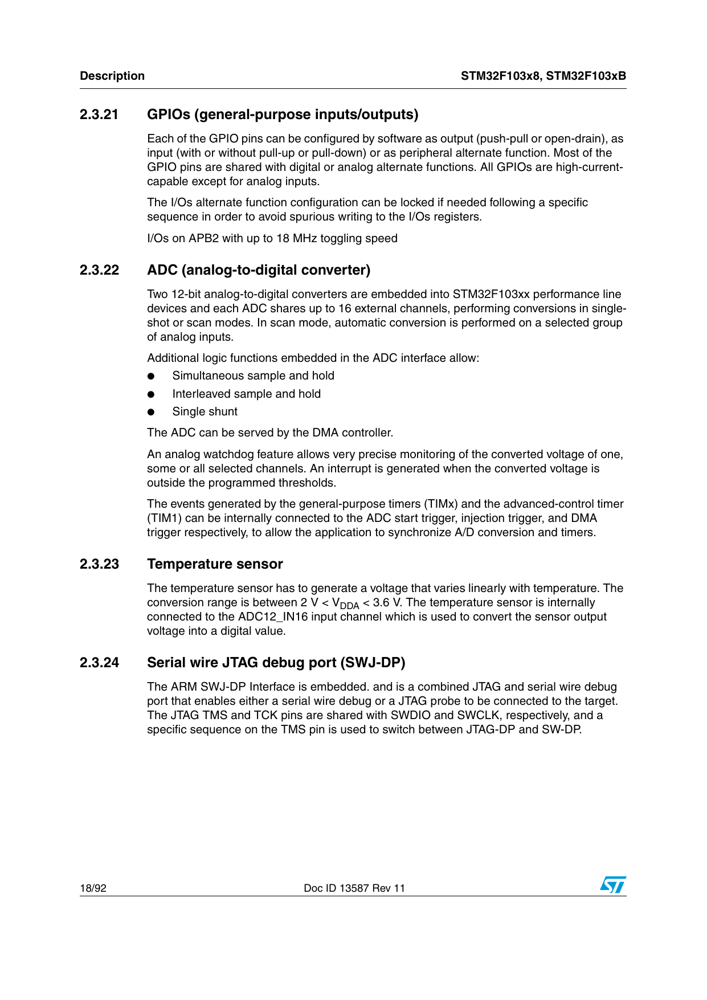
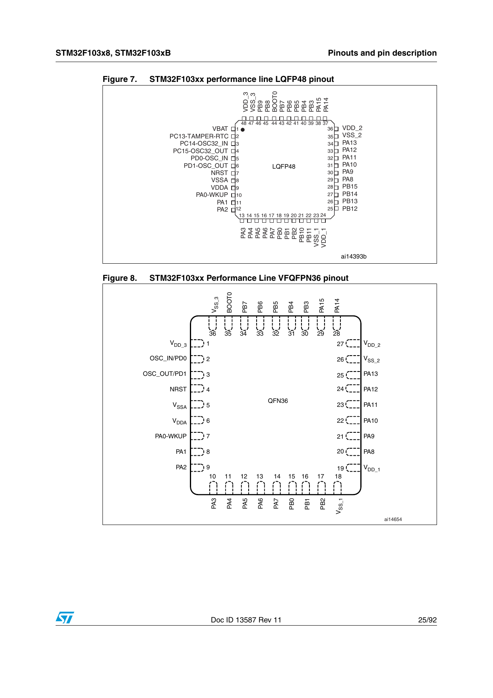

# Bölüm 09 — GPIO ve Alternate Function

> *Her pin her an aynı şeyi yapmıyor. Modu sen belirlersin.*

---

> **Bu bölümde öğrendiğin şey şurada da geçerli:**
> ✓ RP2040 ✓ nRF52 ✓ GD32 — her ARM Cortex-M işlemcide GPIO pinleri
>   yazılımla input/output/alternate function arasında yapılandırılır.
> ✓ ESP32'de de (Xtensa/RISC-V çekirdek, Cortex-M değil) aynı kavram bir
>   GPIO matrisi üzerinden çalışır. Kayıt isimleri ve mimari değişir,
>   "pin çok görevli, modu yazılım seçer" kavramı değişmez.

---

## GPIO Nedir?



GPIO: General Purpose Input/Output — Genel Amaçlı Giriş/Çıkış.

STM32F103'te 48 pinin büyük çoğunluğu GPIO olarak kullanılabilir.

**"Genel amaçlı"** demek: sabit değil, yapılandırılabilir.

---

## GPIO Modları

Her GPIO pini 4 farklı modda çalışabilir:

### 1. Input (Giriş)
Dışarıdan sinyal okuyor.

Alt modlar:
- **Floating** → Bağlantısız, belirsiz
- **Pull-up** → Dahili direnç pin'i HIGH'da tutar
- **Pull-down** → Dahili direnç pin'i LOW'da tutar
- **Analog** → ADC için ham sinyal (dijital tampon devre dışı)

### 2. Output (Çıkış)
Dışarıya sinyal gönderiyor.

Alt modlar:
- **Push-Pull** → Hem HIGH hem LOW sürebilir
- **Open-Drain** → Sadece LOW sürülür, HIGH için harici pull-up gerekir

### 3. Alternate Function (Alternatif İşlev)
Pin bir çevresel birime devredilmiş: USART, SPI, I2C, Timer, USB...

Alt modlar:
- **AF Push-Pull**
- **AF Open-Drain**

### 4. Analog
ADC veya DAC için kullanılırken dijital giriş tampon devre dışı bırakılır.

---

## Alternate Function Nedir?

Her GPIO pini birden fazla işlev yapabilir.

Bunlar önceden belirlenmiş. İstediğini seçemezsin — datasheet'te hangi pine hangi fonksiyonun atanabileceği yazıyor.

Örnek — PA9 pini:

```
PA9 (varsayılan GPIO)
  veya
PA9/USART1_TX (USART1 veri gönderme)
  veya
PA9/TIM1_CH2 (Timer1 kanal 2)
```

Yazılımda hangi modu seçersen pin o işlevi üstlenir.

---

## Blue Pill Pinout'ta Alternate Function'lar



Pinout kartında renkli kutular alternate function'ları gösteriyor:

| Renk | Fonksiyon |
|---|---|
| Sarı | Serial (USART) |
| Mor | SPI |
| Açık yeşil | I2C |
| Pembe | CAN |
| Turuncu | PWM (Timer) |
| Kırmızı | Analog giriş |

---

## Şemada Alternate Function Okumak

Şemada işlemci pinlerinin yanına tam isim yazılmış:

```
PA11 → USBDM
PA12 → USBDP
PA13 → JTMS/SWDIO
PA14 → JTCK/SWCLK
PB6  → I2C1_SCL/USART1_TX
PB7  → I2C1_SDA/USART1_RX
```

PB6 neden iki isim taşıyor?
Çünkü aynı pin hem I2C SCL hem USART TX olabilir.
İkisi aynı anda kullanılamaz — yazılımda biri seçilir.

---

## Remapping (Yeniden Haritalama)

Bazı fonksiyonlar iki farklı pine atanabiliyor.

Örnek — USART1:

| Varsayılan | Remap |
|---|---|
| TX → PA9 | TX → PB6 |
| RX → PA10 | RX → PB7 |

Neden? Şema tasarımında esneklik. Başka bir çevresel birim PA9'u kullanıyorsa USART PB6'ya taşınabilir.

---

## LED Örneği — PC13

Şemada D2 (mavi LED):

```
+3.3V
  │
  R5 (510Ω)
  │
  D2 (LED, mavi)
  │
  PC13 pini
```

PC13 → Port C, Pin 13.

Bu pin OUTPUT modunda yapılandırıldığında:
- PC13 = LOW → LED yanar (akım akar)
- PC13 = HIGH → LED söner

Şemada "PC13/TAMPER_RTC" yazıyor. Yani bu pin aynı zamanda RTC tamper girişi olarak da kullanılabilir.

---

## Sahada Ne Anlama Gelir?

Şemada bir pini takip ediyorsun. Pinin birden fazla ismi var.

```
PB6/I2C1_SCL/USART1_TX
```

Bu pine bağlı devreye bakıyorsun:
- Bir EEPROM bağlıysa → I2C modu kullanılıyor
- Bir modüle seri bağlıysa → USART modu kullanılıyor

Yazılımı okumadan bile bağlı devreden hangi modun kullanıldığını anlayabilirsin.

---

## Sonraki bölüm

**[10 — İletişim Protokolleri](../10-iletisim-protokolleri/README.md)**
