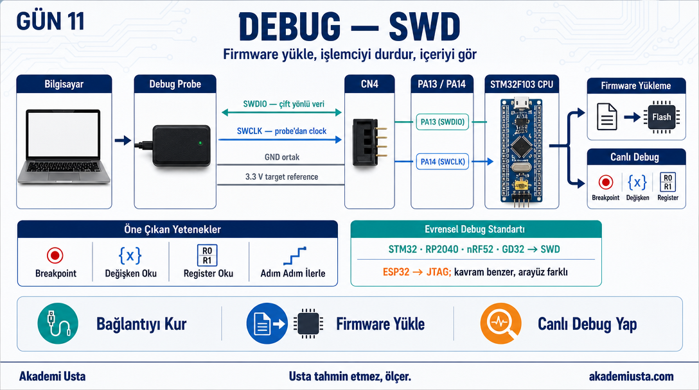
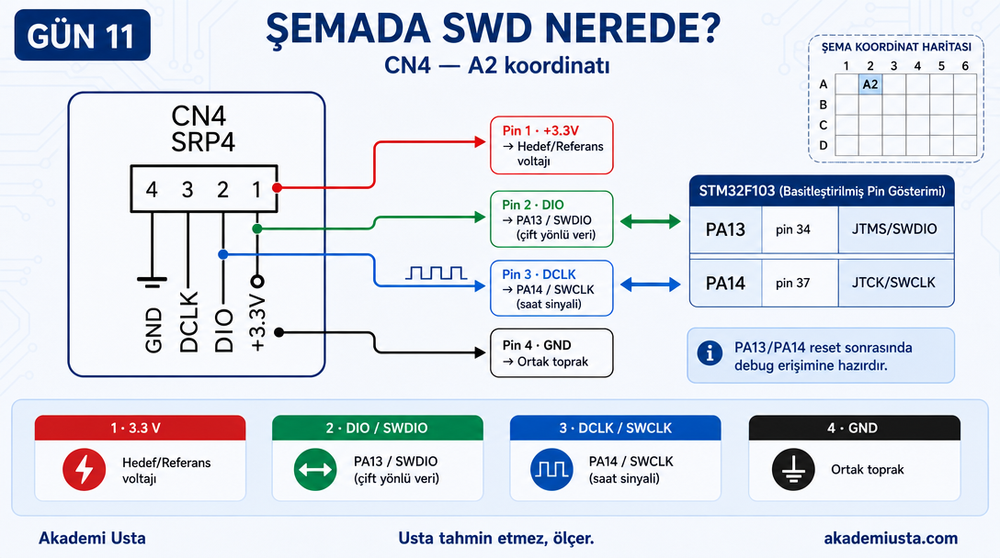
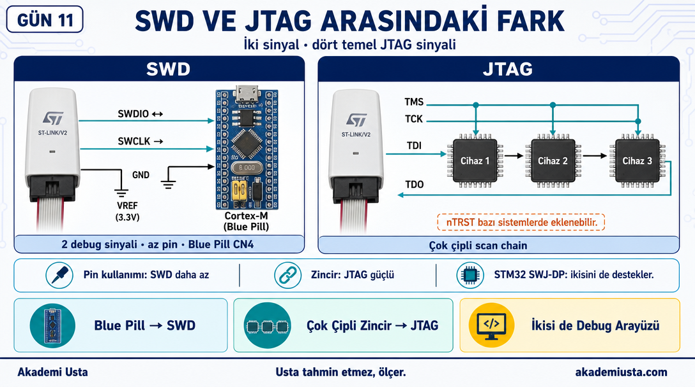
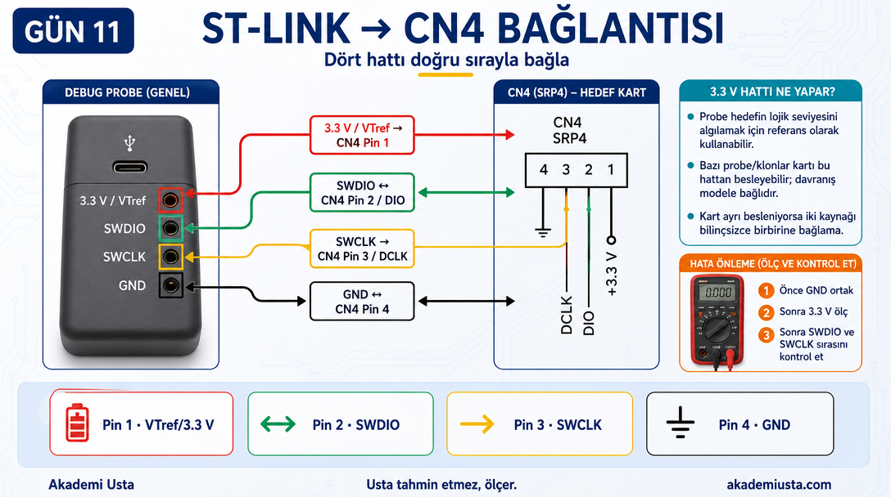
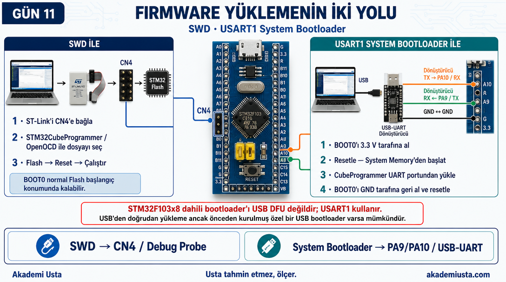
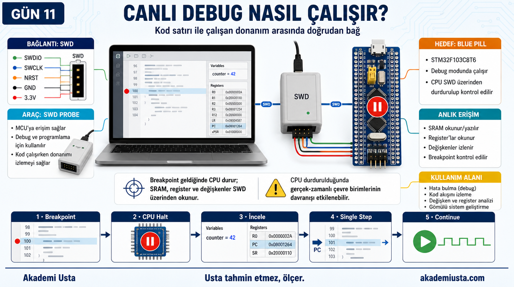
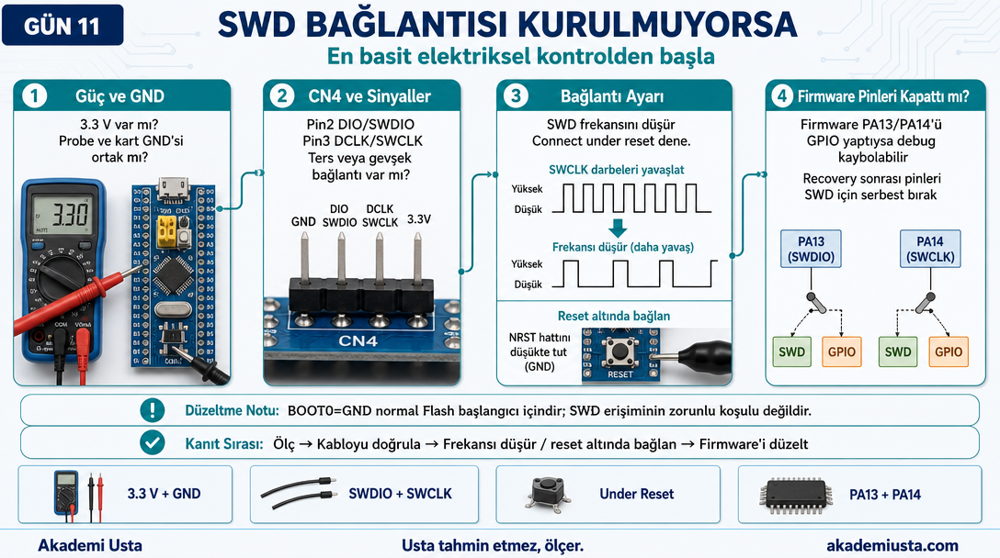

# Bölüm 11 — Debug — SWD

> *Firmware bu pinlerden giriyor. Sorun da buradan tespit ediliyor.*



---

> **Bu bölümün kapsamı:**
> SWD, ARM Cortex-M tabanlı işlemcilerde (✓ STM32 ✓ RP2040 ✓ nRF52 ✓ GD32)
> kullanılan programlama/debug arayüzüdür. ✓ ESP32 gibi ARM dışı çekirdekler
> (Xtensa/RISC-V) SWD değil JTAG kullanır — kavram benzer, arayüz farklı.
> (Apple/Qualcomm gibi büyük SoC'lerde debug erişimi üretici tarafından
> kilitlenir veya çok daha karmaşık bir güvenlik zincirinden geçer — bu
> basit 2-pin mantığıyla aynı değildir.)

---

## SWD Nedir?

SWD: Serial Wire Debug

STM32'ye firmware yüklemek ve canlı debug yapmak için kullanılan protokol.

Sadece 2 sinyal pini ile:
- Firmware yükleyebilirsin
- Canlı çalışan kodu durdurabilirsin
- Değişkenlerin anlık değerini okuyabilirsin
- Breakpoint koyabilirsin

---

## Şemada SWD — CN4

Şemada sol üst — **A2 koordinatı**.

```
CN4 (SRP4 — 4 pinli konnektör)

Pin 1 → +3.3V (hedef gerilim referansı; kullanılan probe'a göre besleme amacıyla da kullanılabilir)
Pin 2 → DIO  (SWDIO — PA13)
Pin 3 → DCLK (SWCLK — PA14)
Pin 4 → GND
```

---

## SWD Pinleri İşlemcide Nerede?

```
PA13 → JTMS/SWDIO (pin 34)
PA14 → JTCK/SWCLK (pin 37)
```

Bu iki pin reset sonrasında otomatik olarak SWD modunda başlar.
Yani özel bir yapılandırma gerektirmiyor — ST-Link bağla, hazır.



---

## JTAG ile Farkı Nedir?

| Özellik | SWD | JTAG |
|---|---|---|
| Pin sayısı | 2 sinyal | 4-5 sinyal |
| Hız | Benzer | Benzer |
| Zincir | Tek işlemci | Birden fazla |
| Yaygınlık | Modern ARM'lerde standart | Eski, çok çipli sistemler |

STM32'de her ikisi de destekleniyor. Blue Pill'de SWD daha pratik — daha az pin, CN4 konnektörü zaten var.



---

## Programlama Aracı — ST-Link

ST-Link, ST Microelectronics'in resmi debug aracı.

Bağlantı şöyle kurulur:

```
ST-Link       ←→     CN4 (Blue Pill)
3.3V  ────────────── Pin 1 (opsiyonel)
SWDIO ────────────── Pin 2 (DIO)
SWCLK ────────────── Pin 3 (DCLK)
GND   ────────────── Pin 4 (GND)
```

Alternatif: J-Link, OpenOCD destekli adaptörler.



---

## Firmware Yükleme Süreci

### SWD üzerinden (ST-Link ile):
```
1. ST-Link'i CN4'e bağla
2. BOOT0 jumper: normal pozisyon (GND)
3. STM32CubeProgrammer veya OpenOCD aç
4. Firmware dosyasını (.hex veya .bin) seç
5. Flash — tamamlandı
6. Kart otomatik çalışmaya başlar
```

### USART1 üzerinden (System Memory Bootloader ile):
```
1. BOOT0 jumper'ını 3.3V tarafına al
2. Kartı resetle
3. USB-UART dönüştürücüyü PA9 (TX) / PA10 (RX) ve GND'ye çapraz bağla
4. STM32CubeProgrammer → UART portunu seç ve firmware yükle
5. BOOT0 jumper'ını GND tarafına al
6. Kartı resetle — normal çalışma
```

STM32F103x8'in dahili system-memory bootloader'ı USART1 kullanır. Kart yalnız BOOT0'ı
3.3V tarafına almakla USB DFU cihazına dönüşmez. USB'den doğrudan yükleme ancak karta daha
önce ayrıca uygun bir USB bootloader kurulmuşsa mümkündür.

**Not:** Jumper'ın fiziksel silkscreen pin numaraları (Bölüm 07'de de belirtildiği gibi)
elimizdeki şema/fotoğraflarda doğrulanamadı — "3.3V tarafı" / "GND tarafı" diye anılıyor,
kesin pozisyon için kartındaki BOOT0 yazısının yanındaki pinlere multimetreyle bak.



---

## Canlı Debug Nedir?

Firmware yükledikten sonra kart çalışırken:

- İşlemciyi istediğin satırda durdurabilirsin
- Değişkenlerin o andaki değerini görebilirsin
- Register'ların durumunu okuyabilirsin
- Adım adım ilerleyebilirsin

Bu, SWD üzerinden canlı/doğrudan bir bağlantıyla yapılıyor — ama "gerçek zamanlı" kelimesi
yanıltıcı olabilir: breakpoint'te CPU durduğu anda timer'lar, iletişim hatları gibi
çevre birimlerinin gerçek-zamanlı davranışı da etkilenir/durur. Yani gördüğün, çalışan sistemin
donmuş bir anlık görüntüsüdür, kesintisiz akan bir "gerçek zaman" değil.



**Not:** Görseldeki kablo lejantı NRST sinyalini de listeliyor — Blue Pill'in CN4'ünde NRST
yok (CN4 sadece 4 pin: 3.3V/DIO/DCLK/GND), ama bazı diğer kartların/probe'ların standart
10-pinli SWD konnektöründe bulunabilir.

---

## Sahada Ne Anlama Gelir?

**Durum 1:** ST-Link bağlandı ama cihaz tanınmıyor.

Kontrol:
```
1. CN4 bağlantısı doğru mu? (pin sırası)
2. GND ortak mı? (en yaygın hata)
3. İşlemci besleniyor mu?
4. PA13/PA14 pinleri başka bir şeye bağlanmış mı?
```

**Durum 2:** Firmware yüklenmiyor, "target not found" hatası.

Kontrol:
```
1. İşlemci besleniyor mu ve GND ortak mı?
2. SWDIO/SWCLK sırası doğru mu?
3. SWD bağlantı frekansını düşürmeyi dene
4. Gerekirse "connect under reset" ile bağlanmayı dene
```

BOOT0=GND, kullanıcı firmware'inin normal olarak Flash'tan başlaması içindir; SWD erişiminin
zorunlu koşulu değildir.

**Durum 3:** Kart çalışıyor ama debug bağlantısı kurulamıyor.

Muhtemel sebep:
```
PA13 veya PA14 yazılımda GPIO olarak yapılandırılmış.
Bu pinler SWD için ayrılmalı — yazılımda serbest bırakılmamalı.
```



---

## Sonraki bölüm

**[12 — Şema Baştan Sona](../12-sema-bastan-sona/README.md)**
