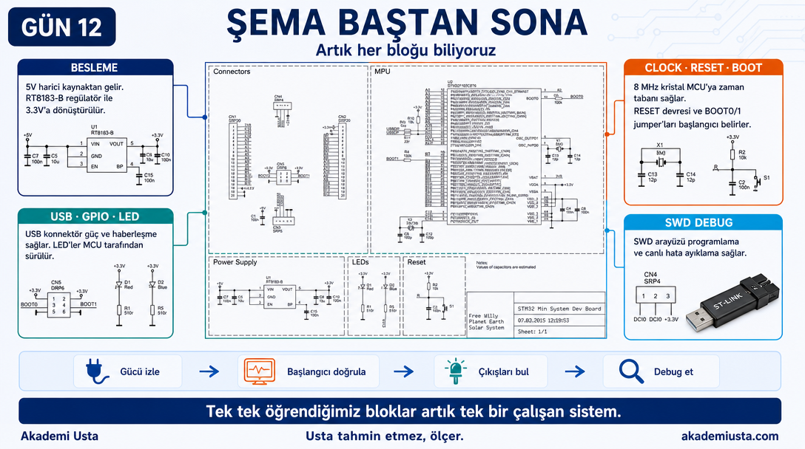
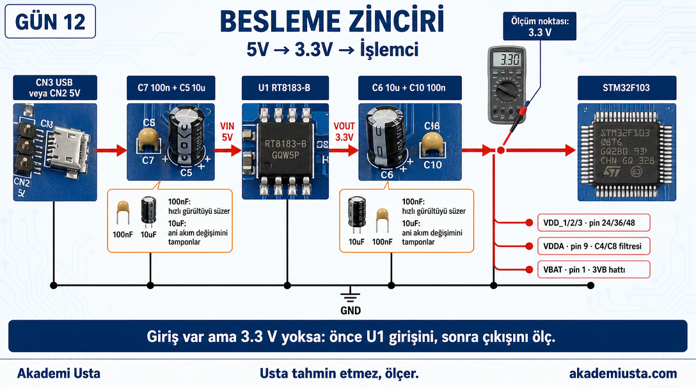
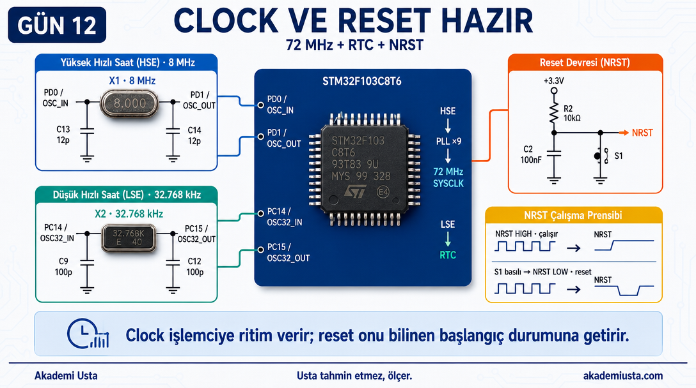
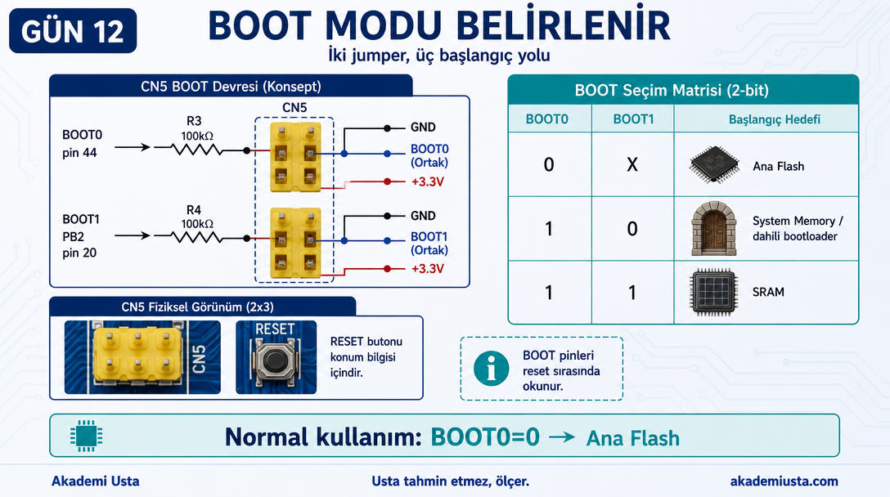
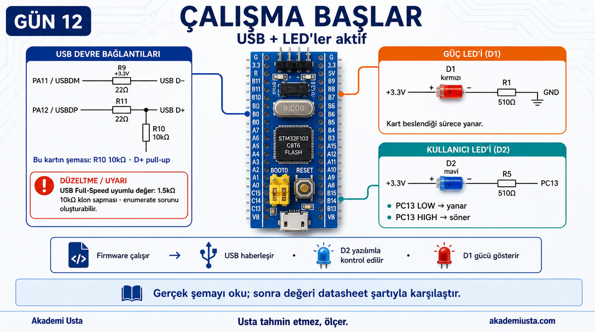
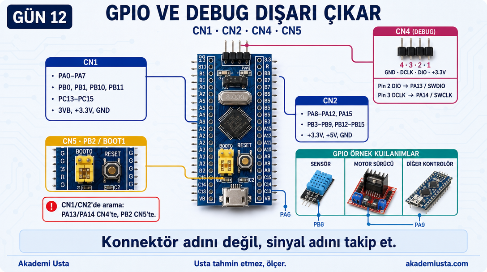
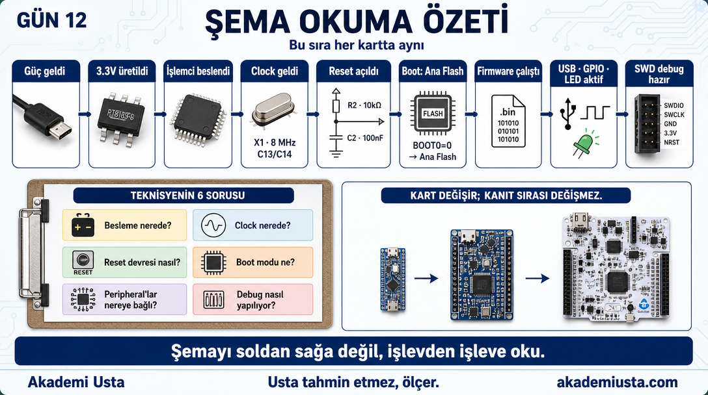
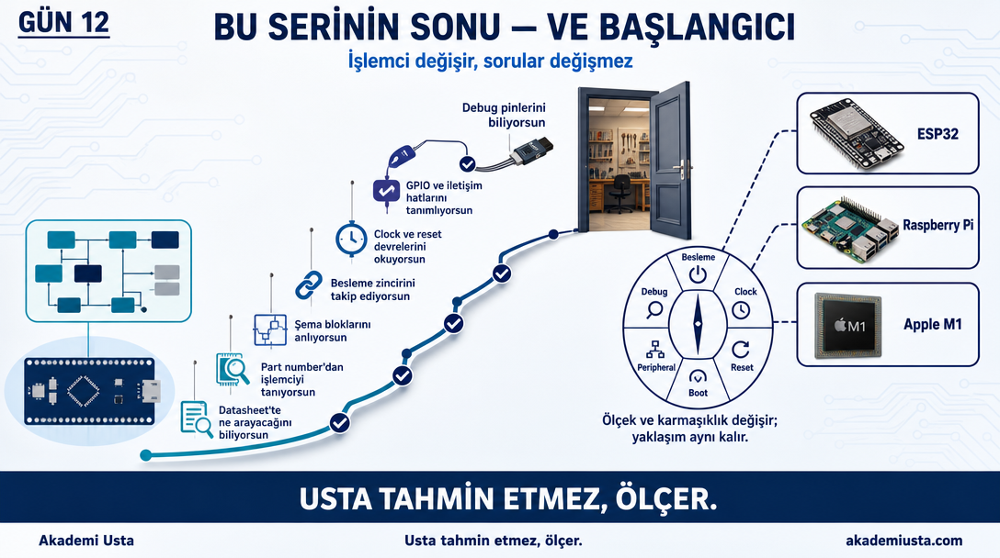

# Bölüm 12 — Şema Baştan Sona

> *Artık her bloğu biliyoruz. Şimdi hepsini birlikte okuyalım.*



**Not:** Görseldeki "SWD Debug" panelinde CN4 sadeleştirilmiş biçimde 3 pinle gösterilir; Blue
Pill'in gerçek CN4'ü 4 pindir (3.3V/DIO/DCLK/GND) — tam ve doğru pin şeması için aşağıdaki
"11. Debug / Programlama Hazır" bölümüne ve o bölümün görseline bakın.

---

## Blue Pill Şeması


Bu şemayı ilk bölümde gördük.

O zaman bilmiyorduk. Şimdi biliyoruz.

Baştan sona geçelim.

---

## 1. Kartı Besle

```
USB micro-B veya 5V pin → +5V
```

Şemada CN3 (SRP5, USB konnektörü) veya CN2'nin 5V pini.

5V hattı:
```
+5V ── C7(100n) // C5(10u) ── GND   (giriş filtresi)
    └── U1 VIN (RT8183-B)
```

---

## 2. Gerilim 3.3V'a Dönüşür

```
U1 (RT8183-B)
VIN = +5V → VOUT = +3.3V
```

3.3V çıkışı filtreleniyor:
```
+3.3V ── C6(10u) // C10(100n) ── GND
```

---

## 3. İşlemci Besleme Alır

```
+3.3V → VDD_1 (pin 24)
+3.3V → VDD_2 (pin 36)
+3.3V → VDD_3 (pin 48)
+3.3V → VDDA  (pin 9) + C4/C8 filtresi
+3.3V → VBAT  (pin 1) — 3VB hattı
GND   → VSS_1, VSS_2, VSS_3, VSSA
```



---

## 4. Clock Gelir

```
X1 (8 MHz crystal)
  OSC_IN (PD0) ─── X1 ─── OSC_OUT (PD1)
  C13(12p) ve C14(12p) yük kapasitörleri
```

İşlemci içinde:
```
HSE (8 MHz) → PLL × 9 → 72 MHz SYSCLK
```

```
X2 (32.768 kHz crystal)
  OSC32_IN (PC14) ─── X2 ─── OSC32_OUT (PC15)
  C9(100p) ve C12(100p) yük kapasitörleri
  → LSE → RTC
```

---

## 5. Reset Devresi Hazır

```
+3.3V
  │
  R2 (10kΩ) ─── NRST (işlemci)
                │
               C2 (100nF) ─── GND
               │
              S1 (buton) ─── GND
```

İşlemci NRST = HIGH → çalışıyor.
S1'e basınca NRST = LOW → reset.



---

## 6. Boot Modu Belirlenir

```
BOOT0 (pin 44):
  R3 (100kΩ) üzerinden CN5 jumper'ın ortak ucuna bağlı — R3 sabit bir pull-down DEĞİL.
  GND ve +3.3V, jumper'a doğrudan bağlı (jumper'ın 2 seçilebilir tarafı).
  Jumper GND tarafındaysa → Ana Flash'tan başla (BOOT1 dikkate alınmaz).

BOOT1 (PB2, pin 20):
  Aynı mantık — R4 (100kΩ) üzerinden CN5'in kendi ortak ucuna bağlı, sabit bir
  pull-down DEĞİL.

Seçim tablosu:
  BOOT0=0, BOOT1=X → Ana Flash
  BOOT0=1, BOOT1=0 → System Memory (dahili bootloader)
  BOOT0=1, BOOT1=1 → SRAM
```



---

## 7. İşlemci Çalışmaya Başlar

Reset açılır. Boot modu okunur. Flash'tan kod çalışır.

---

## 8. USB Aktif Olur

```
USBDM (PA11) ── R9(22Ω)  ── USB D-
USBDP (PA12) ── R11(22Ω) ── USB D+
                              │
                        R10(10kΩ) → +3.3V
```

R10 pull-up → Host "Full Speed USB cihazı var" algılar.

**Not (bkz. Bölüm 08):** USB spesifikasyonu bu direnç için 1.5kΩ ister, gerçek değer 10kΩ —
bilinen bir Blue Pill klon sapması, bazı host'larda enumerate sorunlarına yol açabilir.

---

## 9. LED'ler Çalışır

```
Power LED (D1, kırmızı):
+3.3V → D1 → R1(510Ω) → GND
Kart beslendiği sürece yanar.

Kullanıcı LED'i (D2, mavi):
+3.3V → D2 → R5(510Ω) → PC13
PC13 = LOW → LED yanar
PC13 = HIGH → LED söner
```



---

## 10. GPIO Pinleri Dışarıya Çıkar

```
CN1 (SRP20): PA0-PA7, PB0/PB1/PB10/PB11, PC13-PC15, 3VB, +3.3V, GND
CN2 (SRP20): PA8-PA12/PA15, PB3-PB9/PB12-PB15, +3.3V, +5V, GND
```

(PA13/PA14 ve PB2 bu iki konnektörde YOK — PA13/PA14 CN4'te (SWD), PB2 CN5'in BOOT1 ucunda
ayrı çıkıyor. Bu yüzden pin aralıkları düzgün 0-15 sırasıyla gitmiyor, CN1/CN2 arasında
bölünmüş durumda.)

Bu konnektörler üzerinden:
- Sensör bağlanabilir
- Motor sürücü bağlanabilir
- Başka bir kart bağlanabilir

---

## 11. Debug / Programlama Hazır

```
CN4 (SRP4):
Pin 1 → +3.3V
Pin 2 → DIO  (PA13/SWDIO)
Pin 3 → DCLK (PA14/SWCLK)
Pin 4 → GND
```

ST-Link bu 4 pine bağlanır. Firmware yüklenir.



---

## Şema Okuma Özeti

```
Güç geldi
    ↓
RT8183-B 3.3V üretiyor
    ↓
İşlemci besleme aldı
    ↓
Crystal clock veriyor
    ↓
Reset açıldı
    ↓
Boot modu: Flash
    ↓
Firmware çalışıyor
    ↓
USB, GPIO, LED aktif
    ↓
SWD ile debug/programlama hazır
```

**Bu akışın mantığı her kartta aynı — ama fiziksel sıra/yerleşim karttan karta değişebilir.**

İşlemci farklı olabilir. Üretici farklı olabilir. Şemadaki yerleşim farklı olabilir.
Değişmeyen, sorduğun sorulardır:

1. Besleme nerede?
2. Clock nerede?
3. Reset devresi nasıl?
4. Boot modu ne?
5. Peripheral'lar nereye bağlı?
6. Debug nasıl yapılıyor?



**Not:** Görseldeki son adımın SWD ikonu, standart 10-pinli ARM debug header'da bulunan bir
NRST sinyalini de gösterir — Blue Pill'in kendi CN4'ünde NRST yok (4 pin: 3.3V/DIO/DCLK/GND),
bazı diğer kartların/probe'ların konnektöründe bulunabilir.

---

## Bu Serinin Sonu — Ve Başlangıcı

Bu noktaya gelen biri artık:

✅ Bir datasheet'i açıp ne arayacağını biliyor\
✅ Part number'dan işlemciyi tanımlayabiliyor\
✅ Şemadaki her bloğun ne iş yaptığını anlıyor\
✅ Besleme zincirini takip edebiliyor\
✅ Clock ve reset devrelerini okuyabiliyor\
✅ GPIO ve iletişim hatlarını tanımlayabiliyor\
✅ Debug pinlerini biliyor

**Aynı bakış açısı:**

- ESP32 şemasına bak → aynı sorular
- Raspberry Pi şemasına bak → aynı sorular
- Apple M1 tabanlı bir karta bak → aynı sorular

İşlemci değişir. Sorular değişmez.



> *Usta tahmin etmez, ölçer.*

---

*Blue Pill Explained — Akademi Usta*\
*Lisans: MIT*
